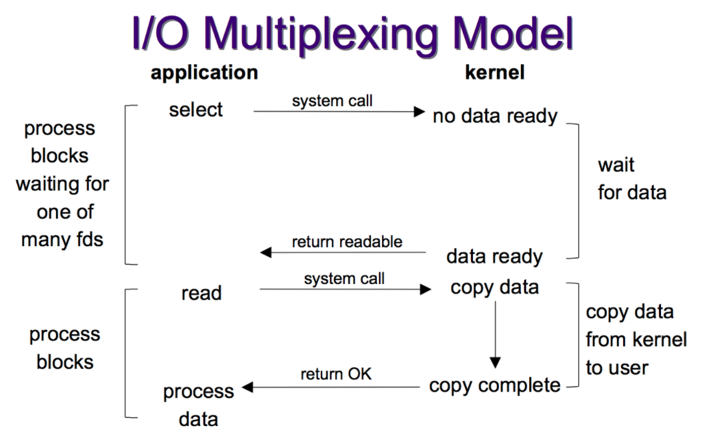

# Netty4 Action

## 网络通信

### 网络五层模型

```
应用层
传输层      四层交换机、四层路由器
网络层      路由器、三层交换机
数据链路层  网桥、以太网交换机、网卡
物理层 		中继器、集线器、双绞线
```

### 数据

- 数据帧

  ```
  Head 18 字节 发送者｜源地址 6 字节 接受者|目标地址 6 字节 数据类型 6 字节
  Data 最短 46字节 最长 1500 字节
  最短 64 字节，最长 1518 字节(超过分片发送)
  ```

- MAC

  ```
  通信数据帧
  目 标  MAC 地址 6B
  发送源 MAC 地址 6B
  TPID 2B
  TCI 2B (含 12 位 VLAN 标识)
  类型 2B
  数据内容 46-1500 字节
  CRC 4B
  ```

- IP

  ```
  32 位二进制 4 段十进制表示
  主机位 + 网络位
  子网掩码 &
  ABCD
  ```

- IP 数据包

  ```
  HEAD 20 - 60 B
  DATA 65515 B
  ```

- ```
  以太网头部｜IP 头部｜TCP[UDP]头部 数据
  ```

- DNS

  ```
  顶级域名 TLD 分为 国家顶级域名 nTLD、通用顶级域名 gTLD、基础结构域名
  域名服务器分为 根域名服务器、顶级域名服务器、本地域名服务器、权限域名服务器
  DNS 使用 TCP|UDP 53 端口，对于每一级域名长度限制是 63 字符，域名总长度不能超过 253 字符
  ```

  

### ARP

```
Ip 找 MAC
广播发出，单播回复
arp -a
```

### Port

```
关联 app 和 网卡
TCP 头部留给存储端口空间 2B 
 0    - 1023  系统保留
1024  - 49152 用户注册
49152 - 65535 随机动态
```

### 建立连接

```
shake_step1:
	client 发送 SYN (syn=1) -> server 进入 SYN_SENT 等待 server 确认
shake_step2:
	server 接受 SYN 确认 client SYN（ack=x+1） 发送 SYN （syn=1）SYN + ACK server 进入 SYN_RECV 状态
shake_step3:
	clent 接收到 server SYN + ACK ，向 server 发送确认包 ACK (sck=y+1) 此包发送完毕，建立起连接
```


### 连接释放

```
wave_step1 
```

### 网络通信原理

```

```

### 浏览器+URL

```
1.DNS 服务器解析域名 -> IP
2.发送 HTTP 请求
3.TCP 设置端口，封装数据
4.IP 封装数据+TCP数据，设置双方IP
5.以太网协议 封装IP数据包，设置双方MAC地址（ARP
6.服务器响应，TCP返回数据
```

### Socket

```
通信双方建立连接后，各自维护一个文件，可以写入内容供对方读取，通信结束关闭文件
```

## IO

```
操作系统内核创建文件描述符（File Descriptor,非负整数）标识 Socket，UNIX 一切皆文件
```

### IO 交互

```
用户进程一次完整的 IO 交互流程分为两个阶段
首先经过内核空间，操作系统处理
接着到达用户空间，交由应用程序处理
```

### 用户态和内核态

```
内核态与用户态是Linux 两级保护机制的两种运行级别
Ring0是留给操作系统代码，设备驱动程序代码使用的，它们工作于系统核心态
Ring3则给普通的用户程序使用，它们工作在用户态
```

``转换``

- 外围设备中断 ring3 -> ring0
- 异常 ring3 -> ring0
- 系统调用 ring3 -> ring0 （主动）

```
对于输入操作，进程 I/O 系统调用后，内核会先看缓冲区中有没有相应的缓存数据，如果没有再到设备中读取
设备 I/O 一般速度较慢，内核缓冲区有数据则直接复制到进程空间
所以，网络输入操作一般包括两个阶段
1.等待网络数据到达网卡，然后将数据读到内核缓冲区
2.从内核缓冲区复制数据，然后拷贝到用户空间
```

``I/O 有 内存 I/O、网络 I/O、磁盘 I/O``

## I/O通信模型

**网络环境下 I/O 简单分为两步，第一步等待，第二部数据迁移 **

**提高 I/O 效率，将等待时间降低，发展了五种   { I/O 模型，阻塞 I/O、非阻塞 I/O、多路复用 I/O、信号驱动 I/O } 同步、异步 I/O**

### 1.阻塞 I/O

```
当用户进程调用了 recvfrom 系统调用
内核就开始 I/O 第一阶段准备数据
很多时候苏剧还没有到达，这个时候内核就要等待数据到来
这个时候用户进程就会被阻塞
当数据准备好时，就会吧数据从内核拷贝到用户内存，返回结果，用户进程解除阻塞状态
```

```
阻塞 I/O 在 I/O 执行两个阶段（等待数据和拷贝数据）都被阻塞,但进程阻塞挂起不消耗 CPU
BIO
```

### 2.非阻塞 I/O

```
当用户进程发出 read 操作时，如果内核中的数据还没有准备好，它并不会阻塞用户进程，而是立刻返回一个 error
从用户进程角度讲，发起一个 read 操作后，并不需要等待，马上就可以得到结果
用户进程判断结果是一个 error 时，他就知道数据还没有准备好，可以再次发送 read 操作
一旦内核数据准备好了，再次收到用户进程系统调用，就马上把数据拷贝到用户内存
```

```
非阻塞 I/O 需要不断的主动询问内核数据准备好了没有
Socket 设置 NON_BLOCK
需要进程轮询（重复调用）,消耗 CPU 资源，适合并发量小不需要及时响应的网络应用开发
```

### 3.多路复用 I/O

```
多个进程的 I/O 可以注册到一个复用器(selector)上
当用户进程调用 selector，selector 会监听所有注册进来的 I/O
如果监听的所有 I/O 在内核缓冲区都没有可读数据，selector 调用进程会被阻塞
当任意一个 I/O 在内核缓冲区有可读数据时，select 调用就会返回
调用进程可以自己或者通知另外的进程（注册进程）再次发读取 I/O，读取内核准备好的数据
多个注册进程注册 I/O 后，只有一个select 调用进程被阻塞
```

```
selector 可以处理多个连接，在处理连接上优于BIO,类似幼儿园教师
对于每一个 socket 一般都设置为非阻塞，但是整个用户的进程其实是一直被阻塞（select函数阻塞），不是socket I/O 阻塞
NIO、nginx(epoll、poll、select)
```

### select、poll、epoll

- ### select

```
select 的核心功能是调用tcp文件系统的poll函数，不停的查询
如果没有想要的数据，主动执行一次调度（防止一直占用cpu），直到有一个连接有想要的消息为止
从这里可以看出select的执行方式基本就是不停的调用poll,直到有需要的消息为止。
缺点：
1、每次调用select，都需要把fd集合从用户态拷贝到内核态，这个开销在fd很多时会很大；
2、同时每次调用select都需要在内核遍历传递进来的所有fd，这个开销在fd很多时也很大；
3、select支持的文件描述符数量太小了，默认是1024。
优点：
1、select的可移植性更好，在某些Unix系统上不支持poll()。
2、select对于超时值提供了更好的精度：微秒，而poll是毫秒。
```

- ### poll

```
poll本质上和select没有区别
它将用户传入的数组拷贝到内核空间，然后查询每个fd对应的设备状态
如果设备就绪则在设备等待队列中加入一项并继续遍历
如果遍历完所有fd后没有发现就绪设备，则挂起当前进程，直到设备就绪或者主动超时，被唤醒后它又要再次遍历fd
这个过程经历了多次无用的遍历
poll还有一个特点是“水平触发”，如果报告了fd后，没有被处理，那么下次poll时会再次报告该fd。
缺点：
1、大量的fd的数组被整体复制于用户态和内核地址空间之间，而不管这样的复制是不是有意义；
2、与select一样，poll返回后，需要轮询pollfd来获取就绪的描述符。
优点：
1、poll() 不要求开发者计算最大文件描述符加一的大小。
2、poll() 在应付大数目的文件描述符的时候速度更快，相比于select。
3、它没有最大连接数的限制，原因是它是基于链表来存储的。
```

- ### epoll

```
epoll同样只告知那些就绪的文件描述符，而且当我们调用epoll_wait()获得就绪文件描述符时
返回的不是实际的描述符，而是一个代表就绪描述符数量的值
你只需要去epoll指定的一 个数组中依次取得相应数量的文件描述符即可
这里也使用了内存映射技术，这样便彻底省掉了这些文件描述符在系统调用时复制的开销。
epoll的优点就是改进了前面所说缺点：
1、支持一个进程打开大数目的socket描述符：
相比select，epoll则没有对FD的限制
它所支持的FD上限是最大可以打开文件的数目，这个数字一般远大于2048
举个例子,在1GB内存的机器上大约是10万左右
具体数目可以cat /proc/sys/fs/file-max察看,一般来说这个数目和系统内存关系很大。
2、IO效率不随FD数目增加而线性下降：
epoll不存在这个问题，它只会对"活跃"的socket进行操作
这是因为在内核实现中epoll是根据每个fd上面的callback函数实现的
那么，只有"活跃"的socket才会主动的去调用 callback函数，其他idle状态socket则不会
在这点上，epoll实现了一个"伪"AIO，因为这时候推动力在os内核
在一些 benchmark中，如果所有的socket基本上都是活跃的，比如一个高速LAN环境，epoll并不比select/poll有什么效率
相 反，如果过多使用epoll_ctl,效率相比还有稍微的下降
但是一旦使用idle connections模拟WAN环境,epoll的效率就远在select/poll之上了。
3、使用mmap加速内核与用户空间的消息传递：
这点实际上涉及到epoll的具体实现了
无论是select,poll还是epoll都需要内核把FD消息通知给用户空间
如何避免不必要的内存拷贝就很重要
在这点上，epoll是通过内核于用户空间mmap同一块内存实现的。
```

- ### 对比

```
select，poll实现需要自己不断轮询所有fd集合，直到设备就绪，期间可能要睡眠和唤醒多次交替
而epoll其实也需要调用epoll_wait不断轮询就绪链表，期间也可能多次睡眠和唤醒交替
但是它是设备就绪时，调用回调函数，把就绪fd放入就绪链表中，并唤醒在epoll_wait中进入睡眠的进程
虽然都要睡眠和交替，但是select和poll在“醒着”的时候要遍历整个fd集合
而epoll在“醒着”的时候只要判断一下就绪链表是否为空就行了，这节省了大量的CPU时间
这就是回调机制带来的性能提升
```

```
select，poll每次调用都要把fd集合从用户态往内核态拷贝一次
并且要把current往设备等待队列中挂一次
而epoll只要一次拷贝，而且把current往等待队列上挂也只挂一次（在epoll_wait的开始，注意这里的等待队列并不是设备等待队列，只是一个epoll内部定义的等待队列）。这也能节省不少的开销。
```

|            | select                                | poll                                  | Poll                                                         |
| ---------- | ------------------------------------- | ------------------------------------- | ------------------------------------------------------------ |
| 最大连接数 | 1024（x86）\| 2048 （x64）            | 无上限                                | 无上限                                                       |
| IO效率     | 每次调用进行线性遍历，时间复杂度 O(N) | 每次调用进行线性遍历，时间复杂度 O(N) | 事件通知方式，当fd就绪，调用回调函数，就绪fd放到fdlist里面，epoll_wait 返回就可以拿到就绪的 fd，时间复杂度 O(1） |
| fd拷贝     | 每次select 都拷贝                     | 每次poll都拷贝                        | 调用epoll_ct时拷贝进内核并有内核保存，之后每次epol_wait不拷贝 |

### 4.信号驱动IO模型

```
信号驱动I/O 是指进程预先告知内核，向内核注册一个信号处理函数，然后用户进程返回不阻塞
当内核数据就绪时会发送一个信号给进程，用户进程你在信号处理函数中调用I/O读取数据
实际上I/O内核拷贝到用户进程的过程还是阻塞的
信号驱动I/O并没有实现真正的异步，因为通知到进程之后，依然由进程来完成I/O操作，伪异步
```

### 5.异步I/O

```
用户进程发起 aio_read 操作后，给内核传递与 read 相同的描述符、缓冲区指针、缓冲区大小三个参数以及文件偏移
告诉内核当整个操作完成时，如何通过我们立刻就可以开始去做其他的事
当内核收到一个 aio_read 之后，首先会立刻返回，不会对用户进程产生任何阻塞
内核等待数据准备完成，将数据拷贝到用户内存
当一切都完成之后，内核会给用户进程发送一个信号，告诉 aio_read 操作完成
```

```
工作机制：
告诉内核启动某个操作，并让内核在整个操作完成后通知我们
信号驱动I/O是内核通知我们何时可以启动一个I/O操作，I/O操作由用户自定义的信号函数实现
异步I/O模型是由内核告知我们I/O操作何时完成
JAVA7 AIO,不阻塞，数据一步到位，采用 Procator 模式（异步事件通知）
```

## 同步、异步、阻塞、非阻塞

- ### 同步和异步

```
同步、异步 是 CPU 时间片的利用，主要看请求发起方对消息结果的获取是主动发起的还是被动通知的
同步阻塞：应用程序（请求方）主动发起，一直等待结果
同步非阻塞：应用程序（请求方）主动发起，处理其他事情，不断轮询请求是否有应答结果
异步阻塞：服务方通知，请求方一直等待
异步非阻塞：服务方通知，请求方作其他事情
异步通知的方式一般通过状态改变、消息通知、回调函数完成
```

- ### 阻塞和非阻塞

```
阻塞时调用一个函数后，在等待这个函数返回结果之前，当前的线程是处于挂起状态还是运行状态
如果挂起，当前线程什么都不能干，等着获取函数返回结果，这就是同步阻塞
如果仍然是运行状态，意味着当前线程可以继续处理其他任务，时不时的需要获取函数结果，这就是同步非阻塞
```

- ### 场景

```
上厕所
同步阻塞：正常上厕所是一直拉，直到拉完，拉的过程就是同步阻塞
同步非阻塞：拉的时候看皮皮虾，刷几个决定要不要站起来结束
异步阻塞：拉着刷皮皮虾，脚不嘛不去想要不要站起来，等到脚嘛直接站起来
异步非阻塞：拉着刷两个皮皮虾没兴趣了站起来走了

```

- ### 总结

```
同步异步看客户端主动获取还是服务端通知
阻塞和非阻塞看客户端等待消息过程是挂起还是继续处理任务
```

## I/O 演进

``BIO -> NIO``

- 面向流和面向缓冲区

  ```
  BIO 面向流，NIO 面向缓冲区
  BIO 每次从流中读一个或者多个字节，直到读取所有字节，没有被缓存在任何地方，不能前后移动流中数据
  如果需要移动从流中读取的数据，需要首先将它缓存到一个缓冲区
  NIO 读取数据到它稍后处理的缓冲区，需要时可以缓冲区中前后移动，相对灵活
  但是还要检查缓冲区是否包含所有需要处理的数据，还要确保更多的数据读取缓冲区时，不能覆盖缓冲区尚未处理的数据
  ```

- 处理（阻塞|非阻塞）

  ```
  BIO 一直到数据被完全读取或者完全写入，线程是被阻塞的
  NIO 是一个线程从某个通道（channel）发送请求读取数据，但是仅能得到目前可用的数据
  如果没有数据可用就什么都不会获取保持线程阻塞，直到数据变成可以读取之前，线程可以继续做其他任务
  写操作也是如此，不需要等待安全写入，线程可以去做其他事情
  线程通常将非阻塞I/O的空闲时间用在其他通道上执行I/O操作，所以一个单独线程可以管理多个I/O通道
  ```

- selector

  ```
  NIO selector 允许一个单独线程监视多个输入通道，注册多个通道使用一个选择器
  使用一个线程单独选择通道
  ```

## AIO

``Asynchronous I/O``

### 基本原理

```
API
AsynchronousServerSocketChannel 服务端
AsynchronousSocketChannel 客户端
CompletionHandler 用户处理器
CompletionHandler 接口实现应用程序向操作系统发起 I/O 请求，当完成后处理具体逻辑，处理完成事件通知没到处理其他任务

多路复用 I/O 模型，时间循环将文件句柄的状态时间通知给用户线程，由用户线程自行读取数据、处理数据
异步 I/O 模型中当用户进程收到通知内核已经将数据放在了用户线程指定的缓冲区内，内核在 I/O 完成后通知线程直接使用就行
```

### 代码实现

```java
package com.aladdin.io;

import lombok.extern.slf4j.Slf4j;

import java.io.IOException;
import java.net.InetSocketAddress;
import java.nio.ByteBuffer;
import java.nio.channels.AsynchronousChannelGroup;
import java.nio.channels.AsynchronousServerSocketChannel;
import java.nio.channels.AsynchronousSocketChannel;
import java.nio.channels.CompletionHandler;
import java.util.concurrent.ExecutorService;
import java.util.concurrent.Executors;

/**
 * AIO 服务器
 * 接受数据并返回
 * @author lgc
 */
@Slf4j
public class AioServer {
    private final int port;

    public static void main(String args[]) {
        int port = 8000;
        new AioServer(port);
    }

    public AioServer(int port) {
        this.port = port;
        listen();
    }

    private synchronized void listen() {
        try {
            ExecutorService executorService = Executors.newCachedThreadPool();
            AsynchronousChannelGroup threadGroup = AsynchronousChannelGroup.withCachedThreadPool(executorService, 1);
            final AsynchronousServerSocketChannel server = AsynchronousServerSocketChannel.open(threadGroup);
            server.bind(new InetSocketAddress(port));
            System.out.println("服务已启动,监听端口：" + port);
            server.accept(null, new CompletionHandler<AsynchronousSocketChannel, Object>() {
                        final ByteBuffer buffer = ByteBuffer.allocateDirect(1024);

                        @Override
                        public void completed(AsynchronousSocketChannel result, Object attachment) {
                            System.out.println("I/O 操作成功，开始获取数据");
                            try {
                                log.info("before read {}",buffer.mark());
                                Integer integer = result.read(buffer).get();
                                log.info("computation result: "+integer);
                                log.info("before flip {}",buffer.mark());
                                buffer.flip();
                                log.info("after flip  {}",buffer.mark());
                                result.write(buffer);
                                log.info("after write {}",buffer.mark());
                                buffer.flip();
                                log.info("after flip  {}",buffer.mark());
                            } catch (Exception e) {
                                System.out.println(e);
                            } finally {
                                try {
                                    result.close();
                                    server.accept(null, this);
                                } catch (Exception e) {
                                    System.out.println(e);
                                }
                            }
                            System.out.println("操作完成");
                        }

                        @Override
                        public void failed(Throwable exc, Object attachment) {
                            System.out.println("I/O 操作失败：" + exc);
                        }
                    }
            );
            try {
                Thread.sleep(Integer.MAX_VALUE);
            } catch (InterruptedException ex) {
                System.out.println(ex);
            }
        } catch (IOException e) {
            System.out.println(e);
        }
    }
}

```


```java
package com.aladdin.io;

import java.net.InetSocketAddress;
import java.nio.ByteBuffer;
import java.nio.channels.AsynchronousSocketChannel;
import java.nio.channels.CompletionHandler;
import java.util.concurrent.TimeUnit;

/**
 * AIO client
 * 发送 接收服务端返回
 * @author lgc
 */
public class AioClient {
    private final AsynchronousSocketChannel client;

    public AioClient() throws Exception {
        client = AsynchronousSocketChannel.open();
    }

    public void connect(String host, int port) throws InterruptedException {
        client.connect(new InetSocketAddress(host, port), null, new CompletionHandler<Void, Void>() {
                    @Override
                    public void completed(Void result, Void attachment) {
                        try {
                            System.out.println("client read to write");
                            client.write(ByteBuffer.wrap("测试数据".getBytes())).get();
                            System.out.println("已发送到服务器");
                        } catch (Exception e) {
                            e.printStackTrace();
                        }
                    }

                    @Override
                    public void failed(Throwable exc, Void attachment) {
                        exc.printStackTrace();
                    }
                }
        );
        TimeUnit.SECONDS.sleep(1);
        final ByteBuffer bb = ByteBuffer.allocate(1024);

        client.read(bb, null, new CompletionHandler<Integer, Object>() {
                    @Override
                    public void completed(Integer result, Object attachment) {
                        System.out.println("I/O 操作完成：" + result);
                        System.out.println("获取反馈结果：" + new String(bb.array()));
                    }

                    @Override
                    public void failed(Throwable exc, Object attachment) {
                        exc.printStackTrace();
                    }
                }
        );
        try {
            Thread.sleep(Integer.MAX_VALUE);
        } catch (InterruptedException ex) {
            System.out.println(ex);
        }
    }

    public static void main(String[] args) throws Exception {
        AioClient aioClient = new AioClient();
        aioClient.connect("localhost", 8000);
    }
}

```

## NIO

``核心对象 Buffer、Selector、Channel``

### Buffer

```
缓冲区其实是一个容器对象，其实就是一个数组，NIO 所有数据都是用缓冲区处理
读取数据时，直接读取到缓冲区中
写入数据时，也是写入缓冲区，任何时候访问 NIO 中的数据都是将它放在缓冲区中
```

```
所有的缓冲区类型都继承抽象类 Buffer 最常用的是 ByteBuffer，基本数据类型都有一个具体的 Buffer 类型与之对应
```

#### 字节序列顺序

```java
处理器芯片决定，intel、amd 是小端字节顺序
大字节序 最高有效位存储在低地址上
小字节序 最低有效位存储在低地址上
中字节序（middle endian），它会以2143的方式来保存数据（相对于大字节序的1234及小字节序的4321）。
ByteOrder byteOrder = ByteOrder.nativeOrder();
System.out.println(byteOrder);//LITTLE_ENDIAN
```


#### IntBufferAction

```java
package com.aladdin.io.nio;

import java.nio.IntBuffer;

/**
 * @author lgc
 */
public class IntBufferAction {
    public static void main(String[] args) {
        //分配 int 类型缓冲区，参数为缓冲区容量
        //新缓冲区的当前位置将为 0,界限为容量大小，具有一个底层实现数组，数组偏移量是 0
        IntBuffer buffer = IntBuffer.allocate(8);
        for (int i = 0; i < buffer.capacity(); i++) {
            int j=2*(i+1);
            buffer.put(j);
        }
        //重设 buffer 将限制位置设置为当前位置，然后将当前位置设置为 0
        buffer.flip();
        //查看在当前位置和限制位置之间是否有数据
        while (buffer.hasRemaining()){
            int i = buffer.get();
            System.out.print(i+" ");
        }
    }
}
```

#### Buffer基本原理

```
缓冲区对象本质是一个特殊的数组，缓冲区对象能够跟踪和记录缓冲区的状态变化情况
如果使用 get() 获取数据或者 put（）写入数据，都会引起缓冲区状态的变化
```

- position

```
指定下一个将要被写入或者读取的元素索引，get()/put() 自动更新，初始化为0
```

- limit

```
指定还有多少数据需要取出（缓冲区写入通道）
还有多少空间可以写入数据（从通道读入缓冲区）
```

- capacity

```
指定可以存储在缓冲区的最大数据容量，指定了可以使用的底层数组容量
```

``0  <== position <==limit <==capacity ``

**flip() 之后只能操作 position  -- limit 范围数据，相当于定位加锁**

```java
  public final Buffer flip() {
        limit = position;
        position = 0;
        mark = -1;
        return this;
    }
```

#### Buffer 缓冲区的分配

```java
/**
 * 创建缓冲区
 * @author lgc
 */
public class AllocateBufferAction {
    public static void main(String[] args) {
        ByteBuffer allocate = ByteBuffer.allocate(10);
        ByteBuffer buffer = ByteBuffer.allocateDirect(10);
        //支持链式
        buffer.put((byte)1).put((byte)2);
        ByteBuffer wrap = ByteBuffer.wrap("123".getBytes());
        ByteBuffer wrap1 = ByteBuffer.wrap("123".getBytes(), 0, 3);
    }
}
```

#### 直接缓冲区

```
由于DirectByteBuffer操作的缓冲区是通过操作系统本地代码创建的
对于java来说创建和销毁DirectByteBuffer更消耗性能
而HeapByteBuffer内部是直接创建的java数组，对于java来说更快
```

```
（1）当从FileChannel读取数据到DirectByteBuffer时
是直接使用DirectByteBuffer相关的本地方法
把数据从本地磁盘中拿出来写入到DirectByteBuffer所对应的堆外内存中。
（2）当从FileChannel读取数据到HeapByteBuffer时
需要先把数据读取到DirectByteBuffer中，再继续从DirectByteBuffer中把数据复制heapByteBuffer
（即先把数据从本地磁盘复制到堆外内存，然后再从堆外内存复制到堆内存中）
所以，当java程序数据需要频繁与本地io（本地磁盘、socket传输数据时）
使用HeapByteBuffer需要读取时要多复制一次数据（即从DirectByteBuffer再复制到heapByteBuffer）
再加上写数据到本地时，又要再从HeapByteBuffer复制到另一个DirectByteBuffer，多了两次复制。
比如从socket读取数据到文件：
（1）使用DirectByteBuffer时：网络->DirectByteBuffer->文件
（2）使用HeadByteBuffer时：网络->新的DirectByteBuffer->HeadByteBuffer->另一个新的DirectByteBuffer->文件
也就是使用HeadByteBuffer时，要从java堆内存（字节数组）里面再读取一遍，相当于多了两个步骤了
```

```
HeapByteBuffer底层其实是java的字节数组
而java字节数组是一个java对象，对象的内存是由jvm的堆进行管理的，那么不可避免的是GC时年轻代的eden、suvivor到老年代的各种复制以及回收
当字节数组比较小的时候还好说，如果是大对象，那么对于jvm的GC来说是一个很大的负担
而使用DirectByteBuffer，则是把字节数组交给操作系统管理（堆外内存），就可以极大的减少jvm的负担了
```

```java
创建缓冲区对象，静态方法 allocate（）创建指定大小的数组并包装成缓冲区对象
 				ByteBuffer allocate = ByteBuffer.allocate(10);
        ByteBuffer buffer = ByteBuffer.allocateDirect(10);//直接内存分配，数据量大时快
        ByteBuffer wrap = ByteBuffer.wrap("123".getBytes());
        ByteBuffer wrap1 = ByteBuffer.wrap("123".getBytes(), 0, 3);
直接内存缓冲区，jvm 直接执行本机 I/O 操作，避免将缓冲区内容拷贝到一个中间件缓冲区或者从一个中间缓冲区中拷贝数据
```

#### 使用场景

```
什么情况下使用DirectByteBuffer（ByteBuffer.allocateDirect(int)）
1、频繁的native IO，即java程序与本地磁盘、socket传输数据。
2、不需要经常创建和销毁DirectByteBuffer对象（执行cpp的构造和析构代价大）（使用池复用DirectByteBuffer）
3、DirectByteBuffer不会占用堆内存 也就是不会受到堆大小限制，只在DirectByteBuffer对象被回收后才会释放该缓冲区。
4、大文件造成大对象，对GC负担比较重的情况

什么情况下使用HeapByteBuffer（ByteBuffer.allocate(int)）
其实除了上述的DirectByteBuffer使用场景之外的，基本可以用HeapByteBuffer
（1）数据仅在java程序中流转传输，不与本地进行IO
（2）容量低，对GC负担低。快速回收
```


#### 缓冲区分片,Duplicate

```java
/**
 * 缓冲区分片 go_slice
 * 注意 slice 一定要确定 position limit 区间
 *
 * @author lgc
 */
public class BufferSliceAction {
    public static void main(String[] args) {
        ByteBuffer buffer = ByteBuffer.allocate(10);
        System.out.println(buffer.mark());
        for (int i = 0; i < buffer.capacity(); i++) {
            buffer.put((byte) i);
        }
        for (int i = 0; i < buffer.capacity(); i++) {
            System.out.println(buffer.get(i));
        }
        System.out.println(buffer.mark());
        buffer.flip();
        //创建子缓冲区
//        buffer.position(3);
//        buffer.limit(7);
        ByteBuffer slice = buffer.slice();
        System.out.println(buffer.mark());
        System.out.println(slice.mark());
        //改变子缓冲区内容
        for (int i = 0; i < slice.capacity(); i++) {
            byte b = slice.get(i);
            b *= 10;
            slice.put(i, b);
        }
//        buffer.flip();
        slice.flip();
        System.out.println("-----");
        System.out.println(buffer.mark());
//        buffer.position(0);
//        buffer.limit(buffer.capacity());
        while (buffer.hasRemaining()) {
            System.out.println(buffer.get());
        }
       ByteBuffer allocate = ByteBuffer.allocate(10);
       ByteBuffer duplicate = allocate.duplicate();
    }
}

```


```
除了可以分配或者包装一个缓冲区对象，还可以根据现有的缓冲区创建一个子缓冲区
现有缓冲区和子缓冲区是数据共享的，子缓冲区相当于一个视图窗口，相当于 go slice
只能操作原缓冲区 position limit 之间的数据
```

#### 只读缓冲区

```java
/**
 * 只读缓冲区 throws ReadOnlyBufferException
 * @author lgc
 */
public class ReadOnlyBufferAction {
    public static void main(String[] args) {
        ByteBuffer buffer = ByteBuffer.allocate(10);
        for (int i = 0; i < buffer.capacity(); i++) {
            buffer.put((byte)i);
        }
        //创建只读缓冲区
        ByteBuffer readOnly = buffer.asReadOnlyBuffer();

        for (int i = 0; i < readOnly.capacity(); i++) {
            byte b = buffer.get(i);
            b*=10;
            buffer.put(i,b);
        }
        readOnly.position(0);
        System.out.println(readOnly.mark());
        while (readOnly.hasRemaining()){
            System.out.println(readOnly.get());
        }
    }
}
```

```
不能将只读缓冲区转换为可写的缓冲区
```

#### 内存映射

```
内存映射是一种读和写文件数据的方法，可以比常规的基于流或者基于通道的 I/O 快得多
内存映射文件 I/O 通过使文件中的数据表现为内存数组的内容来完成
一般来说只有文件中实际读取或写入的部分才会用到内存映射
```

```java
/**
 * 内存映射缓冲区
 *
 * @author lgc
 */
public class MappedBuffer {
    static private final int START = 0;
    static private final int SIZE = 1024;

    public static void main(String[] args) throws IOException {
        RandomAccessFile raf = new RandomAccessFile("", "");
        FileChannel fc = raf.getChannel();

        //把缓冲区和文件进行映射关联
        //只要操作缓冲区里面的内容，文件内容也会跟着改变
        MappedByteBuffer mbb = fc.map(FileChannel.MapMode.READ_WRITE, START, SIZE);
        mbb.put(0, (byte) 97);
        mbb.put(1023, (byte) 122);
        raf.close();
    }
}
```

### Selector

```
传统的 Client/Server 模式会基于 TRP(Thread per Request)，服务器会为每个客户端请求建立一个线程，由该线程会单独负责处理一个客户请求
采用线程池会存在拒绝策略，线程池满了，即使新来的线程消耗很少也无法及时处理
```

```
NIO 中非阻塞 IO 采用了基于 Reactor 模式的工作方式，IO 调用不会被阻塞，而是注册感兴趣的特定 I/O 事件
如果可读数据到达，新的套接字连接等，在发生特定事件时，系统再通知我们
Selector 注册各种 IO，当那些事件发生时，Selector 会通知
```

```
当 Selector 中注册的 IO 发生读或写的时候
可以从 Selector 获得相应的 SelctionKey，同时从 SelectionKey 中可以找到发生的事件和该事件所发生的具体 SelectableChannel，以获得客户端发送过来的数据
```

``NIO开发步骤``

- 向 Selector 对象注册事件
- 从 Selector 中获取事件
- 根据不同事件进行相应的处理

### Channel<I>

```
通道是一个对象，通过通道可以读取和写入数据，所有数据都通过 Buffer 对象来处理
```

#### NIO 读取数据

- 从 FileInputStream 获取 channel
- 创建 Buffer
- 将数据从 Channel 读取到 Buffer


### 多路复用IO

``参考饭店点餐``

- IO 演进


- 多路复用

```
当用户进程调用了select
那么整个进程会被block
而同时，kernel会“监视”所有select负责的socket
当任何一个socket中的数据准备好了，select就会返回
这个时候用户进程再调用read操作，将数据从kernel拷贝到用户进程。
所以，I/O 多路复用的特点是通过一种机制一个进程能同时等待多个文件描述符
而这些文件描述符（套接字描述符）其中的任意一个进入读就绪状态，select()函数就可以返回
```



| 复用模型 | 相对性能 | 关键思路         | 操作系统  | JAVA支持                                                     |
| -------- | -------- | ---------------- | --------- | ------------------------------------------------------------ |
| select   | 较高     | Reactor          | Win/linux | 支持，Reactor模式,Linux kernel 2.4之前，默认使用select       |
| poll     | 较高     | Reactor          | linux     | linux 下的NIO,linux kernel 2.6 之前使用 poll进行支持，也是使用Reactor模式 |
| epoll    | 高       | Reactor/Proactor | Linux     | Linux kernel 2.6以及以后使用epoll 进行支持模拟异步IO         |
| kqueue   | 高       | Proactor         | Linux     |                                                              |

- select

```
int select (int n, fd_set *readfds, fd_set *writefds, fd_set *exceptfds, struct timeval *timeout);
select 函数监视的文件描述符分3类，分别是:

writefds
readfds
exceptfds
调用后select函数会阻塞，直到有描述副就绪（有数据 可读、可写、或者有except）
或者超时（timeout指定等待时间，如果立即返回设为null即可），函数返回。当select函数返回后，可以 通过遍历fdset，来找到就绪的描述符。

select的优缺点
优点
跨平台
select目前几乎在所有的平台上支持，其良好跨平台支持也是它的一个优点。
缺点
单个进程打开的文件描述是有一定限制的，它由FD_SETSIZE设置，默认值是1024，采用数组存储，虽然可以通过编译内核改变，但相对麻烦。
另外在检查数组中是否有文件描述需要读写时，采用的是线性扫描的方法，即不管这些socket是不是活跃的，我都轮询一遍，所以效率比较低
```

- poll

```
int poll (struct pollfd *fds, unsigned int nfds, int timeout);
不同与select使用三个位图来表示三个fdset的方式，poll使用一个 pollfd的指针实现。
struct pollfd {
    int fd; /* file descriptor */
    short events; /* requested events to watch */
    short revents; /* returned events witnessed */
};
pollfd结构包含了要监视的event和发生的event，不再使用select“参数-值”传递的方式。

poll的优缺点
主要优点
采样链表的形式存储，它监听的描述符数量没有限制，可以超过select默认限制的1024大小
缺点
类似select，另外在检查链表中是否有文件描述需要读写时，采用的是线性扫描的方法，即不管这些socket是不是活跃的，我都轮询一遍，所以效率比较低
```

- epoll

```
epoll是在2.6内核中提出的，是之前的select和poll的增强版本
相对于select和poll来说，epoll更加灵活，没有描述符限制
epoll使用一个文件描述符管理多个描述符，将用户关系的文件描述符的事件存放到内核的一个事件表中，这样在用户空间和内核空间的copy只需一次。

int epoll_create(int size)；
int epoll_ctl(int epfd, int op, int fd, struct epoll_event *event)；
int epoll_wait(int epfd, struct epoll_event * events, int maxevents, int timeout);

```

```
int epoll_create(int size);

创建一个epoll的句柄，size用来告诉内核这个监听的数目一共有多大
这个参数不同于select()中的第一个参数，给出最大监听的fd+1的值
参数size并不是限制了epoll所能监听的描述符最大个数，只是对内核初始分配内部数据结构的一个建议。
当创建好epoll句柄后，它就会占用一个fd值，在linux下如果查看/proc/进程id/fd/
是能够看到这个fd的，所以在使用完epoll后，必须调用close()关闭，否则可能导致fd被耗尽。
```

```
int epoll_ctl(int epfd, int op, int fd, struct epoll_event *event)；

函数是对指定描述符fd执行op操作。
epfd：是epoll_create()的返回值。
op：表示op操作，用三个宏来分别表示对fd添加、删除和修改监听事件。
EPOLL_CTL_ADD 添加
EPOLL_CTL_DEL 删除
EPOLL_CTL_MOD 修改。
fd：是需要监听的fd（文件描述符）
epoll_event：是告诉内核需要监听什么事，struct epoll_event结构如下：
struct epoll_event {
  __uint32_t events;  /* Epoll events */
  epoll_data_t data;  /* User data variable */
};

//events可以是以下几个宏的集合：
EPOLLIN ：表示对应的文件描述符可以读（包括对端SOCKET正常关闭）；
EPOLLOUT：表示对应的文件描述符可以写；
EPOLLPRI：表示对应的文件描述符有紧急的数据可读（这里应该表示有带外数据到来）；
EPOLLERR：表示对应的文件描述符发生错误；
EPOLLHUP：表示对应的文件描述符被挂断；
EPOLLET： 将EPOLL设为边缘触发(Edge Triggered)模式，这是相对于水平触发(Level Triggered)来说的。
EPOLLONESHOT：只监听一次事件，当监听完这次事件之后，如果还需要继续监听这个socket的话，需要再次把这个socket加入到EPOLL队列里
```

```
int epoll_wait(int epfd, struct epoll_event * events, int maxevents, int timeout);

等待epfd上的io事件，最多返回maxevents个事件。
参数events用来从内核得到事件的集合，maxevents告之内核这个events有多大，这个maxevents的值不能大于创建epoll_create()时的size，参数timeout是超时时间（毫秒，0会立即返回，-1将不确定，也有说法说是永久阻塞）。该函数返回需要处理的事件数目，如返回0表示已超时。
```

- #### 工作模式

```
工作模式
epoll对文件描述符的操作有两种模式：LT（level trigger）和ET（edge trigger）。LT模式是默认模式，LT模式与ET模式的区别如下：

LT模式：当epoll_wait检测到描述符事件发生并将此事件通知应用程序，应用程序可以不立即处理该事件。下次调用epoll_wait时，会再次响应应用程序并通知此事件。

LT(level triggered)是缺省的工作方式，并且同时支持block和no-block socket.在这种做法中，内核告诉你一个文件描述符是否就绪了，然后你可以对这个就绪的fd进行IO操作。如果你不作任何操作，内核还是会继续通知你的。
ET模式：当epoll_wait检测到描述符事件发生并将此事件通知应用程序，应用程序必须立即处理该事件。如果不处理，下次调用epoll_wait时，不会再次响应应用程序并通知此事件。

ET(edge-triggered)是高速工作方式，只支持no-block socket。在这种模式下，当描述符从未就绪变为就绪时，内核通过epoll告诉你。然后它会假设你知道文件描述符已经就绪，并且不会再为那个文件描述符发送更多的就绪通知，直到你做了某些操作导致那个文件描述符不再为就绪状态了(比如，你在发送，接收或者接收请求，或者发送接收的数据少于一定量时导致了一个EWOULDBLOCK 错误）。但是请注意，如果一直不对这个fd作IO操作(从而导致它再次变成未就绪)，内核不会发送更多的通知(only once)
ET模式在很大程度上减少了epoll事件被重复触发的次数，因此效率要比LT模式高。epoll工作在ET模式的时候，必须使用非阻塞套接口，以避免由于一个文件句柄的阻塞读/阻塞写操作把处理多个文件描述符的任务饿死。

在 select/poll中，进程只有在调用一定的方法后，内核才对所有监视的文件描述符进行扫描。

而epoll事先通过epoll_ctl()来注册一个文件描述符，一旦基于某个文件描述符就绪时，内核会采用类似callback的回调机制，迅速激活这个文件描述符，当进程调用epoll_wait()时便得到通知。(此处去掉了遍历文件描述符，而是通过监听回调的的机制。这正是epoll的魅力所在。)
```

- epoll 优点

```
监视的描述符数量不受限制，它所支持的FD上限是最大可以打开文件的数目，这个数字一般远大于2048
举个例子,在1GB内存的机器上大约是10万左右
具体数目可以cat /proc/sys/fs/file-max察看,一般来说这个数目和系统内存关系很大
select的最大缺点就是进程打开的fd是有数量限制的
这对于连接数量比较大的服务器来说根本不能满足
虽然也可以选择多进程的解决方案( Apache就是这样实现的)
不过虽然linux上面创建进程的代价比较小，但仍旧是不可忽视的
加上进程间数据同步远比不上线程间同步的高效，所以也不是一种完美的方案。

IO的效率不会随着监视fd的数量的增长而下降
epoll不同于select和poll轮询的方式，而是通过每个fd定义的回调函数来实现的
只有就绪的fd才会执行回调函数。

如果没有大量的idle -connection或者dead-connection，epoll的效率并不会比select/poll高很多
但是当遇到大量的idle- connection，就会发现epoll的效率大大高于select/poll。
```

- kqueue

```
kqueue
kqueue与epoll非常相似，最初是2000年Jonathan Lemon在FreeBSD系统上开发的一个高性能的事件通知接口
注册一批socket描述符到 kqueue 以后，当其中的描述符状态发生变化时，kqueue 将一次性通知应用程序哪些描述符可读、可写或出错了。
```

- 总结

```
只有windows IOCP是真正的 asynchronous I/O，其他机制或多或少都会有一点阻塞，epoll 模拟异步 I/O
select低效是因为每次它都需要轮询。但低效也是相对的，视情况而定，也可通过良好的设计改善
epoll, kqueue是Reacor模式，IOCP是Proactor模式。
java nio包是select模型
```

[select poll epoll 讲解](https://segmentfault.com/a/1190000003063859?utm_source=Weibo&utm_medium=shareLink&utm_campaign=socialShare&from=timeline&isappinstalled=0)

### File Destriptor

```
fd 数量限制来自 os 和 用户进程
用户程序的fopen操作最后都通过system call进入到linux kenrel。
linux kernel会对此进行检查，防止某个用户占用太多的系统资源。
现在的内核都可以通过sysctl命令在开机的时候来调整。

命令sysctl fs.file-max=655360 可以调整内核的阈值
参考/etc/sysctl.conf，用命令man sysctl.conf
命令sysctl -a可以显示所有的能够调整参数。
```

```
在bash环境下启动的程序将继承bash缺省的或用户定制的限制。
这个限制可以通过bash的内部命令ulimit来调整，当然不能高过操作系统的限制。
比如命令：ulimit -n 20规定了在当前bash环境下运行的程序只能同时打开20个fd
ulimit -n 命令只能往下调fd，不能往上调。如果你改的过小了，想反悔？好像只能关闭当前的bash再重新开启一个。
那么，bash又是从哪里继承的呢？参考/etc/security/limits.conf，用命令man limits.conf

ulimit -a可以显示包括fd在内的全部阈值：如最大数据段大小、最大代码段大小、最大栈大小、用户能创建的进程的最大数目、一个进程中线程的最大数目。
试试在s2服务器上运行此命令，结果应该是最大可同时打开1024个fd。
man bash，然后查找ulimit。
```


### NIO 源码初探

```
Selector.open
最终 Server 启动完成
主要创建了
WindowsSelectorProvider 单例对象，调用操作系统 api
WindowsSelectorImpl 
1.pollWrapper 保存 Selector上注册的FD,包括 pipe 的 write 端 FD 和 ServerSocketChannel 所用的 FD
2.wakeupPipe 通道，其实是两个 FD 一个是 read 端 一个是 write 端
Selector 的 select() 方法主要调用了 WindowsSelectorImpl 的 doSelect() 方法
最终调用 poll0（native method）轮询 pollWrapper 中保存的 FD
poll0 会监听 pollWrapper 中的 FD 有没有数据进出，这个会造成 I/O 阻塞，知道有数据读写事件发生
如果FD 中数据有变化(read write) poll0 就会返回，没有发生变化就一直阻塞，selector.select 阻塞
所以在 OPerationServer 的 run() 里要用 while(true) 保证 Selector 接受数据并处理完后继续监听 poll()
```

### 反应堆

```
阻塞 I/O 在调用 InputStream.read() 方法时时阻塞的，会一直等到数据到来(或超时)时才会返回
在调用 ServerSocket.accept() 方法时，也会阻塞到有客户端链接才会返回，每个客户端链接成功后，服务端会启动一个线程去处理客户端的请求
1.当客户端多的时候，会创建大量的处理线程，每个线程都要占用栈空间和一些CPU时间
2.阻塞可能带来频繁的上下文切换，且部分上下文切换可能是无意义的
```

```
NIO
1.有一个专门的线层来处理所有的 IO事件并负责分发
2.事件驱动机制 事件到的时候触发,而不是同步的去监视事件
3.线程通信 线程之间通过 wait,notify 等方式通信，保证每次上下文切换都是有意义的
```

