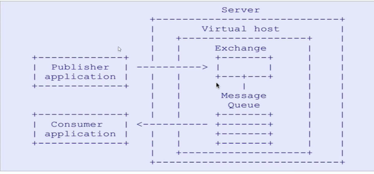

# RabbitMQ

## AMQP协议

```
AMPQ (advanced message queuing protocol) 03年被提出，最早解决金融领域不同平台之间消息传递交互问题
AMPQ 是一种协议【protocol】，是一种 binary wirelevel protocol 【链接协议】
这是和 JMS 的本质差别，AMQP 不从 API 层进行限定，而是直接定义网络交换的数据格式
这使得实现了 AMQP 的 PROVIDER 天然性就是跨平台的
```



## 安装

```
需要 erlang 
socat 支持多协议，用于协议处理，端口转发，rabbitmq 依赖于 socat 
rpm -ivh erlang 
erl -version
yum install -y socat
rpm -ivh rabbitmq-server-xxx
```

```
【安装WEB界面插件】
	rabbitmq-plugins enable rabbitmq_management   
【启动】
	systemctl start rabbitmq-server   
【查看状态】
	systemctl status rabbitmq-server      
【添加admin】
	rabbitmqctl add_user admin admin
【设置权限】 
	rabbitmqctl set_permissions -p / admin ".*" ".*" ".*"
【设置角色】
	rabbitmqctl set_user_tags admin administrator
【设置远程访问】
	rabbitmqctl set_permissions -p / admin "." "." ".*"    
【默认的guest账户只能本地访问】
```

### 角色

```
management: 	用户可以访问管理插件
policymaker:	用户可以访问管理插件，并管理他们有权访问的vhost的策略和参数。
monitoring: 	用户可以访问管理插件，查看所有连接和通道以及与节点相关的信息。
administrator:用户可以做任何监视可以做的事情，管理用户，vhost和权限，关闭其他用户的连接，并管理所有vhost的政策和参数。
```

### 用户操作

```
【新建用户】
	rabbitmqctl add_user username passwd
【删除用户】
	rabbitmqctl delete_user username
【改密码】
	rabbitmqctl change_password {username}{newPasswd}
【设置用户角色】
	rabbitmqctl set_user_tags {username}{tag}
【设置权限】
	rabbitmqctl set_permissions -p / admin "." "." ".*"   
```

### 虚拟主机

```
【创建一个虚拟主机】
rabbitmqctl add_vhost vhost_name
【删除一个虚拟主机】
rabbitmqctl delete_vhost vhost_name
```

### 文件系统

```
【记录rabbitmq运行日常的日志】
/usr/local/rabbitmq_server/var/log/rabbitmq/rabbit@tms.log:
【rabbitmq的崩溃报告】
/usr/local/rabbitmq_server/var/log/rabbitmq/rabbit@tms-sasl.log:
【rabbitmq的配置文件】
/usr/local/rabbitmq_server/etc/rabbitmq/rabbitmq.config：
【rabbit消息持久化文件】
/usr/local/rabbitmq_server/var/lib/rabbitmq/mnesia/rabbit@tms：
```


### 权限

```
【rabbitmqctl set_permissions [-p vhostpath] {user} {conf} {write} {read}】

【Vhostpath】：虚拟主机，表示该用户可以访问那台虚拟主机；
【user】 用户名。
【Conf】 一个正则表达式match哪些配置资源能够被该用户访问。
【Write】一个正则表达式match哪些配置资源能够被该用户设置。
【Read】 一个正则表达式match哪些配置资源能够被该用户访问。
```


### 启停

```
systemctl start rabbitmq-server
systemctl stop rabbitmq-server
```


### 卸载

```
rabbitmqctl
stop_app
停止进程
service rabbitmq-server stop 
查看进程状态kill 掉erlang相关进程
ps -ef |grep rabbit
卸载MQ
yum list|grep rabbitmq
yum  -y remove rabbitmq-server.noarch

卸载erlang
yum  list | grep erlang
yum -y remove erlang.x86_64

删除相关文件
rm -rf /usr/lib64/erlang
rm -rf /var/lib/rabbitmq
rm -rf /usr/lib/rabbitmq/lib/rabbitmq_server-3.8.3/
rm -rf /etc/rabbitmq/
rm  -rf /var/log/rabbitmq
```


## 集群安装

```
【依赖】
	socat
	erlang
	rabbitmq
【集群 hosts 映射】
	xxx mq1
	xxx mq2
	xxx mq3
【修改hostname，作为节点名】
	/etc/hostname
	同步 /var/lib/rabbitmq/.erlang.cookie 【集群内节点要一致】
【节点后台启动】
	rabbitmq-server -detached 【后台启动无页面】
【从节点】
  rabbitmqctl stop_app  【停止】
  rabbitmqctl join_cluster rabbit@mq1【加入集群】
  rabbitmqctl start_app 【启动】
【查看状态】
	rabbitmqctl cluster_status
【停止】
	rabbitmqctl stop_app
	rabbitmqctl start_app
【查看用户】
	rabbitmqctl list_users
```

**服务器重启账户就没了**

```
cd var/lib/rabbitmq/mnesias
生成了新的文件，集群节点是根据主机名配置的，所以要一开始就更该静态主机名 
【hostnamectl set-hostname xxx】，同时修改 /etc/hosts 【127.0.0.1 xxx ::1 xxx】
```


### 镜像配置

```
查看策略信息
rabbitmqctl list_policies
配置策略
rabbitmqctl set_policy ha-all '^' '{"ha-mode":"all","ha-sync-mode":"automatic"}'
删除策略
```

## action

### 1.helloworld

```java
import com.rabbitmq.client.Channel;
import com.rabbitmq.client.Connection;
import com.rabbitmq.client.ConnectionFactory;
import com.rabbitmq.client.MessageProperties;

import java.io.IOException;
import java.util.concurrent.TimeoutException;

/**
 * 直连 点对点
 * @author lgc
 */
public class DirectSend {

    public static void main(String[] args) {
        sendMessage();
    }

    static void sendMessage() {
        //创建链接工厂对象
        ConnectionFactory connectionFactory = new ConnectionFactory();
        connectionFactory.setHost("81.70.30.98");
        connectionFactory.setPort(5672);
        //virtual host
        connectionFactory.setVirtualHost("/cloud-action");
        //username&pass
        connectionFactory.setUsername("admin");
        connectionFactory.setPassword("admin");
        Connection connection = null;
        Channel channel = null;
        try {

            //获取链接对象
            connection = connectionFactory.newConnection();
            channel = connection.createChannel();
            /**
             * channel bind queue
             * queue 不存在自动创建
             * durable 队列是否持久化
             * exclusive 当前链接是否独占队列
             * autoDelete 消费完成是否自动删除队列
             * arguments 额外参数
             */
            channel.queueDeclare("hello", false, false, false, null);

            /**
             * 发布消息
             * exchange 交换器
             * 队列
             * 消息额外设置 消息持久化 MessageProperties.PERSISTENT_TEXT_PLAIN
             * 消息的具体内容 byte[]
             */
            channel.basicPublish("", "hello", MessageProperties.PERSISTENT_TEXT_PLAIN, "hello,rabbitmq".getBytes());
        } catch (RuntimeException | IOException | TimeoutException ex) {
            ex.printStackTrace();
        } finally {

            try {
                assert channel != null;
                channel.close();
            } catch (IOException | TimeoutException e) {
                e.printStackTrace();
            }
            try {
                connection.close();
            } catch (IOException e) {
                e.printStackTrace();
            }
        }
    }
}

```

```java
import com.rabbitmq.client.*;
import java.io.IOException;
import java.util.concurrent.TimeoutException;

/**
 * 消费端回调一直在监听 新开了线程
 * @author lgc
 */
public class DirectConsumer {

    public static void main(String[] args) throws IOException, TimeoutException {
        directConsumer();
    }
    static void directConsumer() throws IOException, TimeoutException {
        //创建连接工厂
        ConnectionFactory connectionFactory = new ConnectionFactory();
        connectionFactory.setHost("81.70.30.98");
        connectionFactory.setPort(5672);
        connectionFactory.setVirtualHost("/cloud-action");
        connectionFactory.setUsername("admin");
        connectionFactory.setPassword("admin");

        Connection connection = connectionFactory.newConnection();
        Channel channel = connection.createChannel();
        channel.queueDeclare("hello",false,false,false,null);

        /**
         * 消费消息
         * param
         * queue 队列
         * autoAck
         * consumer CallBack
         */
        channel.basicConsume("hello",true,new DefaultConsumer(channel){
            /**
             *
             * @param consumerTag
             * @param envelope
             * @param properties
             * @param body 消息队列中取出的消息
             * @throws IOException
             */
            @Override
            public void handleDelivery(String consumerTag, Envelope envelope, AMQP.BasicProperties properties, byte[] body) throws IOException {
                System.out.println("---------------"+new String(body));
            }
        });
    }
}

```

### 2.Work queues

```
消息处理比较耗时，消息可能会堆积
work 模型让多个消费者绑定到一个队列，共同消费队列中的消息，队列中的消息被消费，就会消失，不会被重复消费
【消息消费者默认均衡消费，如果某个消费服务慢会拖慢整体处理性能，这个时候已经分配好了】
```

```java
 public static void main(String[] args) throws IOException {
        Connection connection = RabbitmqUtils.getConnection();
        Channel channel = connection.createChannel();
        channel.queueDeclare("work", true, false, false, null);
        for (int i = 0; i < 10; i++) {
            channel.basicPublish("", "work", MessageProperties.PERSISTENT_TEXT_PLAIN, (i + "hello,work queue").getBytes());
        }
        RabbitmqUtils
```

```java
public static void main(String[] args) throws IOException {
        Connection connection = RabbitmqUtils.getConnection();
        final Channel channel = connection.createChannel();
        //一次消费一个消息，不是全部分配
        channel.basicQos(1);
        channel.queueDeclare("work", true, false, false, null);
        //关闭自动确认
        channel.basicConsume("work", false, new DefaultConsumer(channel) {
            @Override
            public void handleDelivery(String consumerTag, Envelope envelope, AMQP.BasicProperties properties, byte[] body) throws IOException {
                System.out.println("consumer-1: " + new String(body));
                //消费一个 手动确认 队列删除 确认标示和 是否开启多个消息同时确认
                channel.basicAck(envelope.getDeliveryTag(),false);
            }
        });
    }
```


### 3.消息确认机制

```
负载均衡的平均消费，消费者分配到消息后，队列就标记为删除了
如果消费者没有处理玩消息出了问题，就会丢失消息
```

```java
public class WorkQueueConsumer1 {

    public static void main(String[] args) throws IOException {
        Connection connection = RabbitmqUtils.getConnection();
        final Channel channel = connection.createChannel();
        //一次消费一个消息，不是全部分配
        channel.basicQos(1);
        channel.queueDeclare("work", true, false, false, null);
        //关闭自动确认
        channel.basicConsume("work", false, new DefaultConsumer(channel) {
            @Override
            public void handleDelivery(String consumerTag, Envelope envelope, AMQP.BasicProperties properties, byte[] body) throws IOException {
                System.out.println("consumer-1: " + new String(body));
                //消费一个 手动确认 队列删除 确认标示和 是否开启多个消息同时确认
                channel.basicAck(envelope.getDeliveryTag(),false);
            }
        });
    }
}

```

### 4.fanout

`扇出`

```
广播模型
可以有多个消费者
每个消费者有自己的 queue
每个队列都要绑定到 exchange
生产者发送的消息，只能发送到交换机，交换器来决定发送到哪个队列，生产者无法决定
交换器把消息发送给绑定过的所有队列
队列的消费者都能拿到消息，实现一条消息被多个消费者消费
```

**【前两种没有交换器是默认和队列名字相同】**

```java
public static void main(String[] args) throws IOException {
        Connection connection = RabbitmqUtils.getConnection();
        Channel channel = connection.createChannel();

        /**
         * 通道指定交换机
         * param
         * exchange 交换器模型
         * type 交换器模型
         */
        channel.exchangeDeclare("logs", "fanout");
        channel.basicPublish("logs", "", MessageProperties.PERSISTENT_TEXT_PLAIN, "fanout type message".getBytes());
        RabbitmqUtils.closeConnectAndChannel(channel, connection);
    }
```

```java
    public static void main(String[] args) throws IOException {

        Connection connection = RabbitmqUtils.getConnection();
        Channel channel = connection.createChannel();

        /**
         * 通道绑定交换器
         *
         */
        channel.exchangeDeclare("logs", "fanout");
        //临时队列
        String queueName = channel.queueDeclare().getQueue();
        /**
         * 绑定交换器和队列
         */
        channel.queueBind(queueName, "logs", "");
        /**
         * 消费
         */
        channel.basicConsume(queueName, true, new DefaultConsumer(channel) {
            @Override
            public void handleDelivery(String consumerTag, Envelope envelope, AMQP.BasicProperties properties, byte[] body) throws IOException {
                System.out.println("消费者1: " + new String(body));
            }
        });
    }
```

### 5.routing

```
路由指定规则【routingKey】订阅，实现部分消费
队列与交换机的绑定，不能任意指定，需要指定一个 RoutingKey
消息的发送方在向 exchange 发送消息时，也必须指定消息的 RoutingKey
Exchange 不再把消息交给每一个绑定队列，而是根据消息的 RoutingKey 进行判断，只有队列的 RoutingKey 与消息的 RoutingKey 完全一致才会接收到消息
```

`生产场景 日志处理 error 类型日志要单独 持久化`

```java
public static void main(String[] args) throws IOException {
        Connection connection = RabbitmqUtils.getConnection();
        Channel channel = connection.createChannel();
        /**
         * 声明交换机和路由
         */
        channel.exchangeDeclare("logs_direct", "direct");
        String routingKey = "error";
        channel.basicPublish("logs_direct",
                routingKey,
                MessageProperties.PERSISTENT_TEXT_PLAIN,
                ("direct 模型发布的基于 route key :[" + routingKey + "]").getBytes());
        RabbitmqUtils.closeConnectAndChannel(channel, connection);
    }
```

```java
 public static void main(String[] args) throws IOException {
        Connection connection = RabbitmqUtils.getConnection();
        Channel channel = connection.createChannel();

        channel.exchangeDeclare("logs_direct", "direct");
        String queue = channel.queueDeclare().getQueue();
        channel.queueBind(queue, "logs_direct", "info");
        channel.queueBind(queue, "logs_direct", "error");
        channel.queueBind(queue, "logs_direct", "warning");
        channel.basicQos(1);
        channel.basicConsume(queue, false, new DefaultConsumer(channel) {
            @Override
            public void handleDelivery(String consumerTag, Envelope envelope, AMQP.BasicProperties properties, byte[] body) throws IOException {
                System.out.println("consumer 2: " + new String(body));
                channel.basicAck(envelope.getDeliveryTag(), false);
            }
        });
    }
```

### 6.topic

`使用通配符解决 direct  routingKey 规则管理`

``* 匹配单个单词 # 匹配多个单词``

```java
 public static void main(String[] args) throws IOException {
        Connection connection = RabbitmqUtils.getConnection();
        Channel channel = connection.createChannel();

        channel.exchangeDeclare("topics", "topic");
        String routingKey = "user.save";
        channel.basicPublish("topics",
                routingKey,
                MessageProperties.PERSISTENT_TEXT_PLAIN,
                ("routing topic message,routeKey: [" + routingKey + "]").getBytes());
        RabbitmqUtils.closeConnectAndChannel(channel, connection);
    }
```

```java
public static void main(String[] args) throws IOException {
        Connection connection = RabbitmqUtils.getConnection();
        Channel channel = connection.createChannel();
        /**
         * 声明交换器以及交换器类型
         */
        channel.exchangeDeclare("topics", "topic");
        String queue = channel.queueDeclare().getQueue();
        /**
         * 创建临时队列,绑定队列和交换机,routingKey
         */
        channel.queueBind(queue, "topics", "user.*");
        channel.basicQos(1);
        channel.basicConsume(queue, false, new DefaultConsumer(channel) {
            @Override
            public void handleDelivery(String consumerTag, Envelope envelope, AMQP.BasicProperties properties, byte[] body) throws IOException {
                System.out.println("consumer 1 : " + new String(body));
                channel.basicAck(envelope.getDeliveryTag(),false);
            }
        });
    }
```

### 总结

- 不需要交换器 direct queue  绑定 queue 附加信息
- 需要交换器 channel 绑定 exchange queue【temporary】fanout【广播】｜对应 【tag】分组
- 持久化、消息确认机制 保证高可用

## boot-action


## 总结

```
当业务处理过多，其实就是接口代码太多，同步执行耗时，可以拆分为核心非核心功能模块时候，可以使用消息中间件拆解解耦
但是异步处理通过外部消息系统支撑，消息的可靠性传输得不到保障
```

```
springboot 消息确认
消息丢失后是队头插入？？
死信队列
持久化？？持久化位置？？持久化恢复？？
消息记录，链路追踪
```

