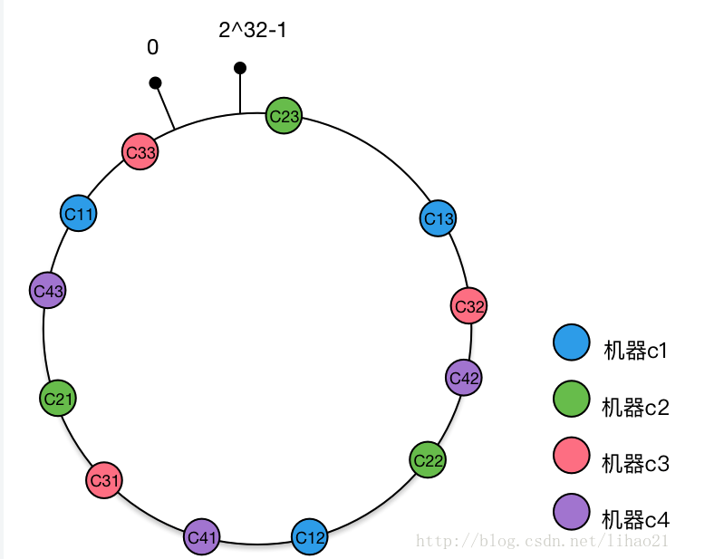

# Dubbo

1. 基本配置

   ```
   参数加载顺序 jvm 启动参数 > xml 配置 > properties
   超时时间（接口，方法超时）
   重试次数(幂等接口)
   启动检查
   多版本
   本地存根 stub
   ```


## 高级应用

### 集群容错处理机制

- Failover Cluster

  ```
  失败自动切换
  当服务调用失败，会切换到集群中的其他机器进行重试
  默认重试次数为 2 ，通过属性 retries 设置，通常用于读操作
  ```

- FailFast Cluster

  ```
  快速失败
  当服务调用失败，立即报错，发起一次调用
  通常用于幂等写操作，避免结果不确定的情况下导致数据重复性插入
  ```

- Failsafe Cluster

  ```
  失败安全，出现异常直接忽略异常
  ```

- Failback Cluster

  ```
  失败后自动回复
  服务调用出现异常，后台记录失败的请求定时重发，消息通知操作保证请求请求发送成功
  ```

- Forking Cluster 

  ```
  并行调用集群中的多个服务，只要其中一个成功就返回，可以通过设置 forks 来设置最大并行数
  ```

- Broadcast Cluster

  ```
  广播调用所有的服务提供者，任意一个报错则表示服务调用失败，通常用于通知所有的服务提供者更新缓存或者本地资源信息
  ```

**@Service(cluster="failfast")**

```
查询语句同错策略使用默认的 Failover Cluster
写操作使用 FailFast Cluster 或者 Failover Cluster(retries=0)
```

**查询接口单独提供**

### 负载均衡

- Random LoadBanlance 【Default】可以设置权重值，权重越大，随机的概率也会越大
- RoundRobin LoadBalance 根据权重轮询
- LeastActive LoadBalance 最少活跃收到更少的请求
- ConsistentHash LoadBalance 一致性 Hash  相同参数的请求总是发送到同一个服务提供者

**@Service(loadbalance=“roundrobin”)**

### 服务降级

```
在流量、服务器压力过大时，对非核心业务进行降级【暂时关闭】，保证核心业务正常运行
```

```
1.故障降级 服务返回异常，设置兜底数据响应
2.限流降级 请求流量达到阈值，拦截后续请求，进入排队
```

```
Dobbo 提供了 Mock 配置来实现服务降级
【消费端需要一个降级接口实现服务接口】
【@Reference（mock="xxx"）】
```

### 主机绑定规则

```
主机绑定 Dubbo 对外发布的 IP 地址
默认情况下按照以下顺序查找并绑定主机 IP 地址
1.环境变量中 DUBBO_IP_TO_BIND 属性配置的 IP 地址
2.dubbo.protocol.host 属性配置的 IP 地址,默认是空，如果没有配置或者 IP 地址不合法继续往下找
3.通过 LocalHost.getHostAddress 获取本机 IP 地址，获取失败继续往下找
4.如果配置了注册中心的地址，使用 Socket 通信连接到注册中心地址后，使用 for 循环通过  socket.getLocalAddress().getHostAddress() 扫描各个网卡获取网卡IP 地址
```

```
绑定的 IP 地址并不会写入到注册中心的地址，默认情况下，写入注册中心的 IP 地址优先选择环境变量中的 DUBBO_IP_TO_REGISTRY 属性配置的 IP 地址
这个没有配置才会选取前面获取的 IP 地址写入到注册中心
```

## SPI

```
Service Provider Interface,将接口实现类的完全限定名配置在文件中，服务加载文件，在运行时动态为接口替换实现类
```

```java
拓展点接口需要 @SPI
在 resources 下的 加载顺序
META-INF/dubbo
META-INF/dubbo/internal
META-INF/services
创建以接口全路径命名的文件
内容是 K=V
【org.apache.dubbo.common.extension】
public interface Loadingstrategy extends Prioritized{
  String dictory();
}
impl
DubboInternalLoadingStrategy
DubboLoadingStrategy
ServicesLoadingStrategy

```

```java
    @Test
    public void javaSpi() throws Exception {
        ServiceLoader<Robot> serviceLoader = ServiceLoader.load(Robot.class);
        System.out.println("Java SPI");
        serviceLoader.forEach(Robot::sayHello);
    }
    @Test
    public void dubboSpi() throws Exception {
        ExtensionLoader<Robot> extensionLoader =
                ExtensionLoader.getExtensionLoader(Robot.class);
        Robot optimusPrime = extensionLoader.getExtension("optimusPrime");
        optimusPrime.sayHello();
        Robot bumblebee = extensionLoader.getExtension("bumblebee");
        bumblebee.sayHello();
    }
@SPI("bumblebee")
public interface Robot {
    void sayHello();
}
```

```
getExtension(String SPIServiceImplName)
根据实现类的名字从缓存取，holder缓存，没有命中就创建一个默认拓展对象，同步去指定路径下加载配置文件查找对应的拓展点实现
设置接口默认实现
Robot defaultExtension = ExtensionLoader.getExtensionLoader(Robot.class).getDefaultExtension();
defaultExtension.sayHello();
```

## Adaptive

```
拓展自适应
```


## 一致性 Hash

```
分布式环境下在进行水平拓展时实现缓存机器的负载均衡
提高水平拓展时缓存命中率，减少 MySQL 服务压力
```

```
通过 【0 - 2^32 -1】 环实现，逆时针分布
将对象、机器、虚拟节点 放入环中
【逆时针最近寻找对象的存储机器】
```

```
取模 Hash 进行负载均衡，如果机器节点变化，缓存命中率很低
Hash 环通过分段分配绑定机器节点，当机器节点变化时候,只需要在变化节点和上一下节点【逆时针】之前的对象走 MySQL 在迁移到下一个节点上
但是，Hash 环虽然提高了命中率，但是缓存机器节点的负载不是均衡的，会影响到单个机器节点的性能
引入了虚拟节点处理负载不均衡
```

```
物理机器节点维护一组虚拟节点，将虚拟节点也放在环上，对象绑定虚拟节点
虚拟节点分散影响其他节点实现负载均衡，再去实现基础取模功能
影响小部分对象分配，同时保证较高的命中率
```



```
超市收银员工上厕所，排队的人自动均衡，超市结账命中率【处理完】极低，入队等待，不太恰当，如果结账是一个圆形的环，单方向的医院护士问诊台可以
```

