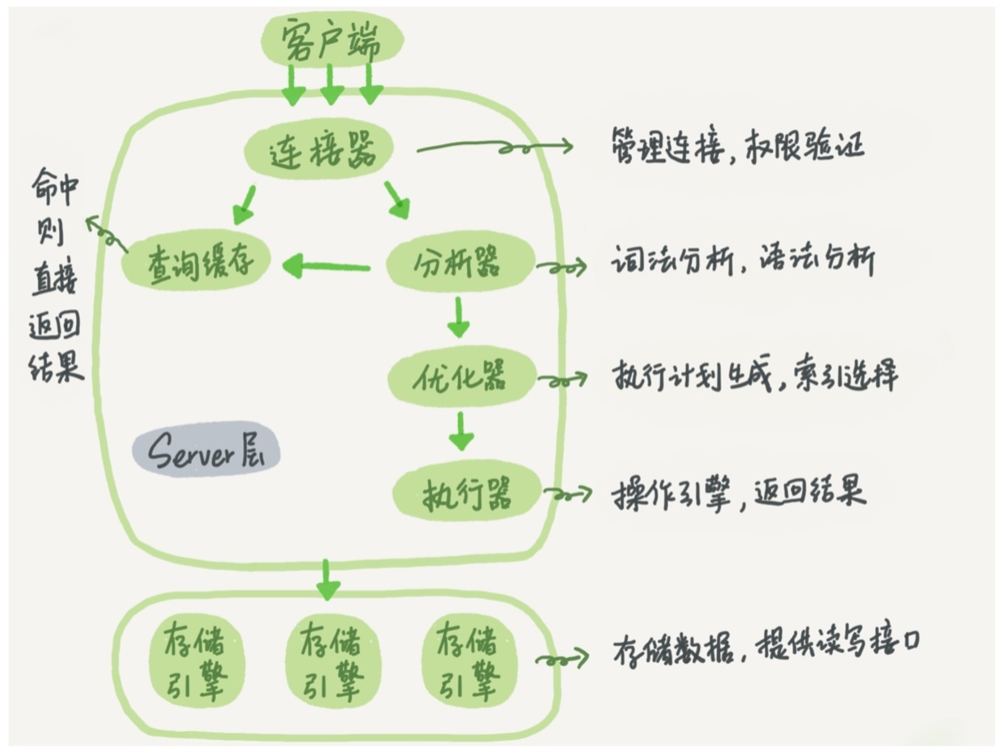
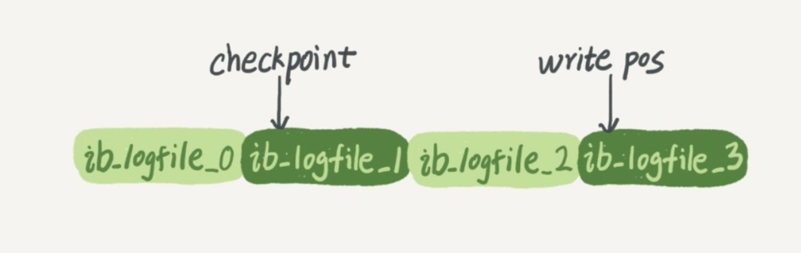
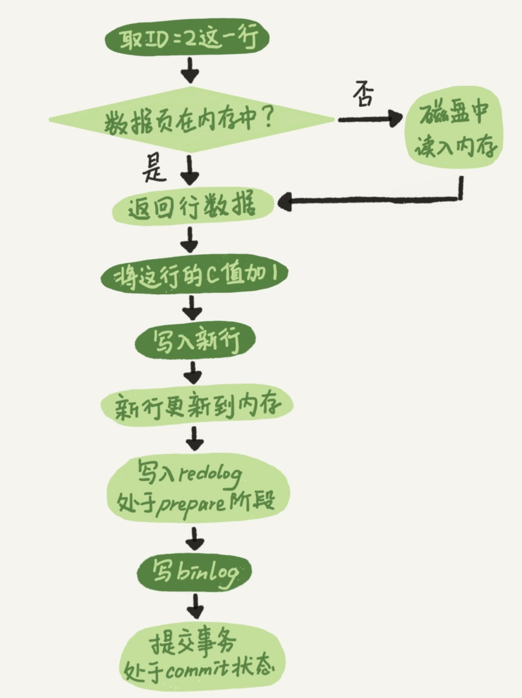
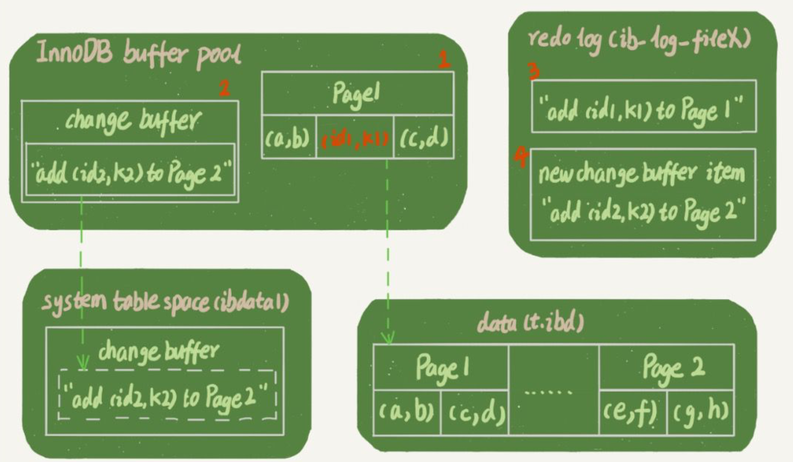
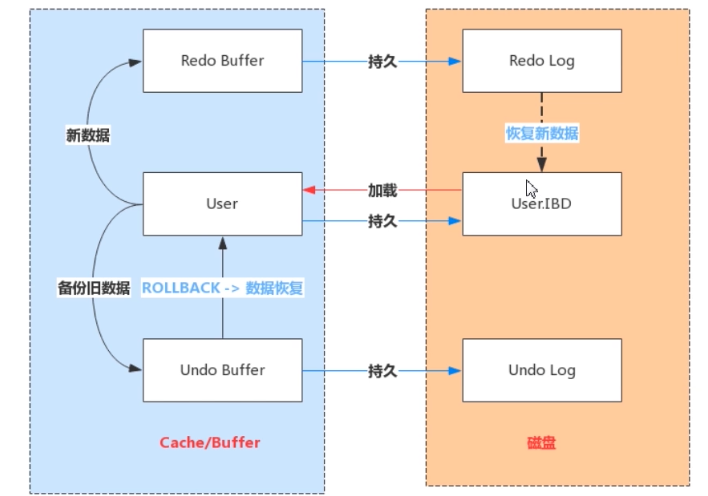
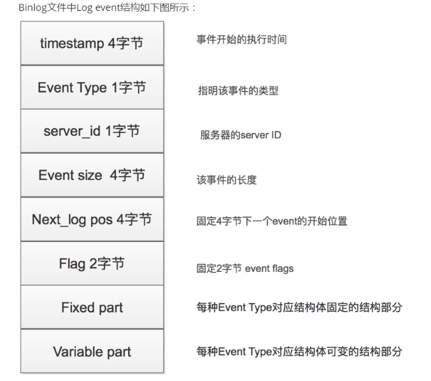

# MySql(sakila)

## 索引

``存储表中特定列的值，并对列进行排序``

### 数据结构

``B-tree B+tree Hash索引 FullText索引 R-Tree 索引``

#### Hash

```
1.Hash 索引 只有 Memory 存储引擎支持 hash 索引[默认]，把数据的索引以 hash 值的形式组织起来，检索效率高，一次定位，不需要多次 IO
2.等值查询比较快，不支持返回查询，因为没有排序，不能避免全表扫描【特别是碰撞】，
3.不能使用部分索引键查询，使用组合索引情况时，是把多个列数据合并后再计算 hash 值，这个时候单独的列没有计算 hash 
```

#### FullText

```
1.MyISAM 支持，只有 char,varcahr,text 类型支持,用于替代 like 模糊匹配，可以通过多字段组合的全文索引一次性全模糊匹配多个字段
2.使用 B-Tree 存放，使用的是特定算法，将字段数据分隔后再进行索引（一般四个字节一次分隔）
3.索引文件存储的是分隔前的索引字符串集合与分隔后的索引信息，对应Btree结构的节点存储的是分隔后的词信息以及他在分隔前的索引字符串集合中的位置
```

#### B+Tree

```
适合排序
带顺序的访问指针，所有索引数据都在叶子结点上，增加了顺序访问指针
每个叶子结点都有指向相邻叶子结点的指针【提高区间查询效率，找到第一个位置，顺着指针便利就可以一次性访问到所有数据结点】
```

#### 磁盘预读&局部性处理

```
磁盘不是严格的按需读取，每次都会预读，读一个数据页【4k】的整数倍
磁盘顺序读取效率比随机读取效率高,随机读取增加了寻址的耗时
mysql 将一个结点大小设置为一页，每个节点只需要一次 IO 就可以完全载入
每次新建一个节点的时候，直接申请一个页的空间，可以保证一个节点物理上也存储在一个页里面，os 存储分配按照页对齐，这样就实现了一个结点只需要一次IO
B-Tree 一次检索最多需 h-1 次 io
逻辑上和跟结点离得很近的结点，物理存储可能离得很远
随着树的深度增加，需要更多次的访问磁盘io了，预读就可能失效
```

#### 没有主键

```
如果表没有主键，甚至都没有唯一键索引的话

InnoDB内部会基于一个包含了ROW_ID值的列生成一个隐式的聚簇索引，行都会根据这个ROW_ID排序
ROW_ID是一个6个字节，即48位的单调递增字段。有新数据插入时，就会生成一个新的递增的ROW_ID。所以，根据ROW_ID排序的行，本质上是按照插入顺序排序
所有用 row_id 列的表，共享同一个被保存在数据字典中的全局序列数，持久化占用内存

如果没有主键，并且也没有一个趋势递增的唯一键，那么所有这些表都会依赖一个全局序列计数器生成的ROW_ID来构造一个隐式聚簇索引，这就会导致竞争从而引起性能问题。
如果随机主键，那么所有页都会被频繁写入，从而导致无法高效的缓存页。并且频繁的裂变还会导致页填充率不理想，从而额外占用很多的磁盘空间。
```


## 一条 sql 执行过程

### 基本架构

```
								客户端
								连接器   【管理连接，权限验证】
			查询缓存 		       分析器 【词法分析，语法分析】
       	                优化器 【执行计划生成，索引选择】
										  	执行器 【操作引擎，返回结果】
										  	
										  	
			存储引擎 存储引擎 存储引擎 【存储数据】
```

-   Server 层

  ```
  包括 连接器、查询缓存、分析器、优化器,涵盖大多数核心服务功能，以及所有的内置函数
  所有跨存储引擎的功能都是这一层实现，比如存储过程，触发器，视图等
  ```

- 存储引擎层

  ```
  存储引擎负责数据存储和提取,架构模式是插件式的，支持 innodb，mysql5.5之后默认
  MyISAM 拥有较高的插入和查询的速度
  MEMORY 是内存型引擎，重启数据丢失
  ```

### 连接器

```
连接器负责跟客户端简历连接，获取权限，维持和管理连接
mysql -h$ipi -p$post -u$user -p
如果用户账号密码验证通过，拦截器会到权限表里查询出拥有的权限，之后，这个链接里的权限都依赖此时读到的权限
用户建立连接了，其实对用户权限进行了修改，也不会影响已经存在的权限，只有在新建才会使用新的权限设置
```

```
连接完成后，如果没有后续动作，这个链接就会处于空闲状态
show processlist 可以看到
客户端太长时间没动静连接器会自动断开，wait_timeout 控制，默认值是 8h
```

- 长连接

  ```
  数据库连接成功后，如果客户端持续有请求就一直使用同一个连接
  ```

- 短连接

  ```
  每次执行完很少几次查询就断开连接，下次查询在重新建立一个
  ```

### 长连接

```
全部使用长连接比较消耗内存
mysql 在执行过程中临时使用的内存是管理在连接对象里面的，这些资源会在连接断开的时候才释放
长连接积累下来会导致 oom
解决方案
1.定期断开长连接
2.mysql 5.7 之后版本，可以在每次执行比较大的操作之后 mysql_reset_connnect 来重新初始化连接资源
	这个过程不需重连和权限验证
```

### 查询缓存

```
连接建立后就可以执行语句了
存储引擎拿到一个查询请求后，会先到缓存看，之前是不是执行过这条语句
之前执行过的语句及其结果都会以 key-value 对的形式，被直接缓存在内存中 key 是查询语句，value 是查询结果
如果能找到 key 直接就返回，找不到就执行语句在存入缓存
```

```
缓存失效很频繁，只要对一个表的更新，这个表上的所有查询缓存都会被清空，除非是静态表很长时间才更新一次，才适合使用查询缓存
mysql 提供按需使用的方式，query_cache_type 设置为 DEMAND ，这样对于默认的 sql 语句都不使用查询缓存
当确定需要使用缓存的时候,可以使用 SQL_CACHE 显示指定 eg: select SQL_CACHE * from xxx;
mysql 8.0 版本直接将缓存整个功能删除了
```

### 分析器

```
如果没有命中查询缓存，就要开始真正执行语句
分析器首先进行词法分析，再根据分析的结果分析语规则
```

### 优化器

```
经过了分析器 MySQL 就知道要做什么了，在执行前还要经过优化器的处理
优化器在表里面有多个索引的时候，决定使用哪个索引，或者在一个语句中有多表关联时，决定各个表的链接顺序
```

### 执行器

```
MySQL 通过分析器知道了要做什么，通过优化器知道了要怎么做，就开始执行语句
开始执行的时候，要先判断一下对这个表有没有执行权限
打开表的时候，执行器会根据表的引擎定义，使用引擎提供的接口
```

#### 执行器流程

```
没有索引
调用 InnoDB 引擎接口取表的第一行，判断 某列是否符合条件,不符合就跳过，符合就将这行存在结果集中
调用引擎接口取下一行，重复判断逻辑直到表的最后一行
```

```
满查询日志中 rows_examined 表示这个语句执行过程中扫描了多少行,就是在执行器每次调用引擎接口获取数据行的时候累加的
[在某些场景下，执行器调用一次，在引擎内部扫描多行，因此引擎扫描行数跟 rows_examined 并不是完全相同的]
```

## 一条更新语句是如何执行的

``MySQL 执行流程``



```
更新流程涉及到两个重要的日志模块，redo log , bin log
```

### redo log

```
eg <<孔乙己>> 酒店记账粉板
MySQL 如果每一次的更新操作都需要重新写进磁盘，磁盘找到对应的记录，然后再更新，整个过程的 IO 成本，查找成本都很高
MySQL 采用 WAL Write-Ahead Logging ，关键点就是先写日志，在写磁盘
```

```
当有一条记录需要更新的时候，InnoDB 引擎就会先把记录写到 redo log 里面，并更新内存，这个时候更新就算完成了
同时，InnoDB 会在适当的时候，将这个操作记录更新到磁盘里面，这个更新往往是在系统比较空闲的时候做
```

```
redo log 是固定大小的，比如可以配置一组 4 个文件，每个文件大小是 1 GB , redo log 最大是 4 GB，从头开始写，写到末尾就又回到开头循环写
write pos 是当前记录的位置，一边写一边后移，写到 3 号文件末尾就回到 0 号文件开头
check point 是当前要擦擦除的位置，也是往后推移并且循环的，擦除记录前要把记录更新到数据文件
如果 write pos 追上 check point ,表示 redo log 被写满，这个时候不能在执行新的更新
```



```
有了 redo log Inno DB 就可以保证即使数据库发生异常重启，之前提交的记录都不会丢失，这个能力成为 crash-safe
只要赊账记录记在了粉板上或写在了账本上，之后即使掌柜忘记了，比如突然停业几天，恢复生意依然可以通过账本和粉板上的数据明确赊账账目
```

### bin log 

```
redo log 是引擎层 InnoDB 引擎特有的日志，Server 层也有自己的日志 bin log【只能用于归档，没有 crash-safe 能力】
```

### redo log bin log 区别

```
1.1 redo log 是 InnoDB 引擎特有的
1.2 bin  log 是 MySQL 的 Server 层实现的,所有引擎都可以使用

2.1 redo log 是物理日志，记录的是【在某个数据页上做了什么修改】
2.2 bin  log 是逻辑日志，记录的是这个语句的原始逻辑，比如给 ID=2 这一行的 c 字段加 1

3.1 redo log 是循环写，空间固定会用完
3.2 bin  log 是可以追加写的，文件写到一定大小后会切换到下一个，不会覆盖以前的日志
```

### 更新流程

```
1.执行器先找引擎取到数据，如果查询条件涉及到主键，引擎直接用树搜索找到这一行，如果条件数据行所在的数据页就在内存中，就直接返回给执行器
  否则，需要先从磁盘读如内存，然后在返回
2.执行器拿到引擎给的行数据，更新某列，得到新的一行数据，在调用引擎接口写入这行新数据
3.引擎将这样新数据更新到内存中，同时将这个更新操作记录到 redo log 中，此时 redo log 处于  prepare 状态，然后告知执行器执行完成了，随时可以提交事务
4.执行器生成这个操作的 bin log ,并把  bin log 写入磁盘
5.执行器调用引擎的提交事务接口，引擎把刚刚写入的 redo log 改成提交状态，更新完成
```



### 两阶段提交

```
两阶段提交，保证了两份日志之间的逻辑一致
如果不用两阶段提交，数据库的状态就有可能和用它的日志恢复出来的库的状态不一致，redo log 【提交事务失败】
数据库扩容拓展的时候，需要全量备份和bin log 实现，可能会导致主从不一致
```

```
redo log 用于保证 crash-safe 能力
innodb_flush_log_at_trx_commit 这个参数设置成 1 的时候，表示每次事务的 redo log 都直接持久化到磁盘，保证异常重启 redo log 不丢失
sync_binlog 这个参数设置成 1 的时候，表示每次事务的 binlog 都持久化到磁盘,保证异常重启 bin log 不丢失
```

## 事务隔离

```
事务就是保证一组数据库操作，要么全部成功，要么全部失败，MySQL 事务是在引擎层实现 InnoDB 支持事务，MyISAM 不支持事务
```

### 隔离性与隔离级别

```
ACID Atomicity Consistency Isolation Durability 原子性 一致性 隔离型 持久性
多个事务同时执行的时候可能会出现 脏读，不可重复读，幻读，隔离的越严实，效率就越低
SQL 标准的事务隔离级别包括 
1.读未提交 read uncommitted  【一个事务还没提交时，做的改变就能被别的事务看到】
2.读提交   read committed    【一个事务提交之后，做的改变才会被其他事务看到】
3.可重复读 repeatable read   【一个事务在执行过程中看到的数据，总是和这个事务在启动的时候看到的数据是一致的，没有提交事务，对																其他事务也是不可见的】
4.串行化   serializable      【写会加锁，读也会加锁，当出现读写锁冲突的时候，后访问的事务必须等前一个事务执行完成，才能继续执															行】
```

```
【事务A】 :【启动事务，查询得到值 1 】															【查询得到值 v1】						【查询得到值 V2】【提交事务A】【查询得到值V3】
【事务B】 :【启动事务】             【查询得到值 1】 【将 1 改成 2】 								【提交事务B】
```


- 读未提交

  ```
  V1=2 V2=V3=2
  ```

- 读提交

  ```
  V1=1 V2=2=V3
  ```

- 可重复读

  ```
  V1=V2=1 V3=2
  ```

- 串行化

  ```
  V1=V2=1 V3=2
  ```


```
在实现上，数据库会创建一个视图,访问时候以视图的逻辑结果为准
【重复读隔离级别下，视图是在事务启动的时候创建的，整个事务存在期间都用这个视图,可以认为是静态视图，不受其他事务更新影响】
【读提交隔离级别下，这个视图是在每个SQL语句开始执行的时候创建的】
【读未提交隔离级别下直接返回记录上的最新值，没有视图概念】
【串行化隔离级别直接用加锁的方式避免并行访问】
【Oracle 数据库默认隔离级别就是读提交】
transaction-isolation READ-COMMITTED
```

### 事务隔离实现

```
MySQL 实际上每条记录在更新的时候都会同时记录一条回滚操作，记录上的最新值，通过回滚操作，都可以得到前一个状态的值
```

```
假设一个值从 1 被按顺序改成了 2，3，4 在回滚日志中就有三条记录 
1.将 2 改成 1
2.将 3 改成 2 
3.将 4 改成 3
当前值是 4,在查询这条记录的时候，不同时刻的事务会有不同的 read-view 
同一条记录在系统中可以存在多个版本，就是数据库的多版本并发控制
如果想要得到之前的值，就必须将当前值依次执行之前的回滚操作
```

```
系统判断没有事务再需要【系统里面没有比这个回滚日志更早的 read-view 的时候？？？】用到回滚日志时，回滚日志才会被删除
```

### 长事务

```
长事务意味着系统里面会存在很老的事务视图，由于这些事务随时可能访问数据库里面的任何数据，所以这个事务提交之前，数据库里面它可能用到的回滚记录都必须保留
这样就会导致大量占用存储空间
长事务还可能占用锁
【查询持续时间超过60s事务】
	SELECT *
	FROM information_schema.innodb_trx
	WHERE TIME_TO_SEC(TIMEDIFF(NOW(), trx_started)) > 60;
```

### 事务的启动方式

```
1.显示启动事务语句
	begin / startt transaction  commit/rollback
	【 begin/start transaction 命令并不是一个事务的起点
		 在执行到它们之后的第一个操作InnoDB表的语句（第一个快照读语句），事务才真正启动
		 如果想要马上启动一个事务，可以使用start transaction with consistent snapshot1
	 】
2.set autocommit=0
	会将这个线程的自动提交关掉
	意味着如果你还执行了一个select 语句，这个事务就启动了，而且不会自动提交。
	这个事务持续到你主动执行 commit 或 rollback 语句，或者断开链接
3.commit work and chain
	提交事务并自动启动下一个事务，省去了再次执行begin 语句开销
	show variables like 'completion_type' cause chaining
	AND CHAIN子句在当前结束时立即开始新的事务，并且新事务与刚刚结束的事务具有相同的隔离级别
	新事务也使用与刚刚终止的事务相同的访问模式（READ WRITE或READ ONLY）
	RELEASE子句会导致服务器在终止当前事务后断开当前客户端会话
```

### 如何避免长事务

```
应用端
1.确认是否使用了 set autocommit=0，测试环境可以把 MySQL 的 general_log 开起来看日志
2.确认是否有不必要的只读事务
3.max_execution_time 控制每个语句执行的最长时间，避免单个语句意外执行太长时间
数据库端
1.监控 inforamtion_schema.Innodb_trx 表，设置长事务阈值，超过就报警或者kill
2.Percona pt-kill
3.在业务功能测试阶段要求食醋所有的 general_log ，分析日志行为提前发现问题
4.如果是 MySQL 5.6 或者更新版本，把 innodb_undo_tablespaces 设置为 2(或更大)
```

### General_log

```
从MySQL5.1.6版开始，general query log和slow query log开始支持写到文件或者数据库表两种方式。
并且日志的开启，输出方式的修改，都可以在Global级别动态修改。
【方式1】
grep general_log /etc/my.cnf
general_log = 1
general_log_file = /tmp/general.log
重启后全局生效，会将所有 DDL,DML 操作记录
【方式2】
/* 需要root用户才有访问此文件的权限 */
# 查看状态
show global variables like '%general%';
-- 输出：general_log   | OFF 默认是关闭的
# 开启
-- 设置日志文件保存位置
set global general_log_file='/tmp/general_log';
-- 开启日志功能
set global general_log=on;
-- 查看状态
show global variables like '%general%';
-- 输出：general_log   | ON
【方式3】
# 设置输出类型为 table
set global log_output='table';
# 开启日志功能
set global general_log=on;
# 切换到数据库：mysql
use mysql;
# 设置输出类型为 table
select * from general_log;
```

```
【指令总结】
# 查看日志是否开启
show variables like 'general_log';
# 查看日志输出类型  table或file
show variables like 'log_output';
# 查看日志文件保存位置
show variables like 'general_log_file';
# 设置日志文件保存位置
set global general_log_file='/tmp/general_log';
# 开启日志功能
set global general_log=on;
# 设置输出类型为 table
set global log_output='table';
# 设置输出类型为file
set global log_output='file';
【关闭】
SET GLOBAL general_log = 'OFF';
【清空】
# 找到general_log.CSV文件
cat /dev/null > general_log.csv
```


## mvcc

```
MVCC 数据表中的一行记录，其实可能有多个版本(row)，每个版本有自己的row trx_id,旧版本需要根据当前版本和undo log计算出来

InnoDB为每个事务构造了一个数组，用来保存这个事务启动瞬间，当前正在“活跃”的所有事务ID。
“活跃”指的就是，启动了但还没提交,数组里面事务ID的最小值记为低水位，当前系统里面已经创建过的事务ID的最大值加1记为高水位。
这个视图数组和高水位，就组成了当前事务的一致性视图（read-view），只有版本已提交，而且是在视图创建前提交的才可见

```

#### 快照读&当前读

```
mvcc 可以读到之前的版本数据信息，其实就是快照，只能对比版本号，不能修改
select .... for update/ in share mode 这类加锁查询只会查询当前记录最新版本数据。我们将这种查询称为当前读。
```

```
1.查找超过 60s 的事务
	select * from information_schema.innodb_trx where TIME_TO_SEC(timediff(now(),trx_started))>60
2.MySQL 5.7.8 新增 设置select的时间,能有效控制在主库的慢查询情况，单位毫秒，超时未结束直接报错【5.6 max_statement_time】
	show variables like 'max_execution_time';
```

## 索引

### 常见模型对比

```
哈希表、有序数组、搜索树
1.哈希索引不是有序的，做区间查询的速度是很慢的，适用于等值查询场景
2.有序数组再等值查询和范围查询场景中的性能比较好【二分、循环】，插入数据移动成本较高，适用于静态存储引擎
3.二叉搜索树 每个节点的做儿子<父节点<右儿子 查找和更新时间复杂度是 O(log（N）)【平衡二叉树】
```

```
多叉树
每个节点有多个儿子，儿子之间的大小保证从左到右递增
访问磁盘的情况下二叉树访问数据【树深度影响】就比较耗时，这个时候就用 N 叉树
```

### InnoDB 存储模型

```
每一个索引在 InnoDB 里面对应一颗 B+ 树，【选择 B+ 树 ，可以很好的配合磁盘的读写特性，减少单次查询的磁盘访问次数】
根据叶子结点的内容分为 主键索引和非主键索引
1.主键索引【聚簇索引】的叶子结点存的是整行数据
2.非主键索引【二级索引】的叶子结点存的是主键的值
```

### 主键索引和普通索引区别

```
如果查询条件是索引列，就只需要搜素 B+ 树
如果查询条件是普通索引列，则需要先搜索普通索引树，得到主键的值，再到主键索引树搜索，这个过程称为回表
【非主键索引会多扫描一颗索引树】
```

### 索引维护

```
B+ 树为了维护有序性，插入新值的时候需要做必要的移动维护
如果之前的数据所在数据页已经满了，这个时候需要申请一个新的数据页，然后挪动部分数据过去，这个过程称为【页分裂】
页分裂影响性能和数据页的利用率
【合并】相邻的两个页由于删除了数据，利用率很低之后会将页做合并，合并的过程可以认为是分裂过程的逆过程
【自增主键插入数据模式，每次插入一条新纪录都是追加操作，不涉及挪动其他记录，也不会触发叶子结点的分裂】
【而业务逻辑的字段做主键，不容易保证有序插入，这样写成本相对较高】
【由于每个非主键索引的叶子结点上都是主键的值，如果主键过长，每个二级索引的叶子结点占用也过大】
【只有一个唯一索引，典型的 KV 场景，由于没有其他索引，就不用考虑其他索引的叶子结点大小问题，这个时候要尽量使用主键查询，直接将这个索引设置为主键】
```

### 回表

```
查询条件是普通索引，先查询普通索引树拿到主键索引树的值，再回到主键索引树搜索的过程，称为回表
```

### 覆盖索引

```
select ID from T where k between 3 and 5
这个时候只需要查询 ID （PK）,因为 ID 已经再普通索引树 index(K) 上，因此可以提供查询结果，不需要回表
索引 K 已经覆盖了查询需求，称为覆盖索引
【覆盖索引可以减少树的搜索次数，显著提高查询性能，可以用来优化查询】
【注意 引擎可能读了三条数据，第三条数据不符合结束了查询，这个时候 Server 层它是拿到了两条数据，认为扫描的行数是2】
```

### 联合索引

```
【联合索引顺序】
eg:
市民表 身份证，姓名，地址
index(身份证号，姓名)
如果有高频请求 根据身份证号查询姓名，可以用到覆盖索引，不需要回表查询，减少树扫描
```

### 最左前缀原则

```
避免过多的建立索引，B+树提供了索引的最左前缀来定位记录
eg: index(name,age) 索引项是按照索引定义你里面出现的字段顺序排序的
【where name like 'l%'】 也是可以用上 index(name,age) 的
【不只是索引的全部定义，只要满足最左前缀就可以利用索引来加速检索】
【最左前缀可以是联合索引的最左 N 个字段，也可以是字符串最左 M 个 字符】
【联合索引内字段顺序】
   需要评估索引的复用能力，因为可以支持最左前缀，已经存在 （a,b）这个联合索引后，一般不需要再单独建立 index(a) 了
【如果通过调整顺序，可以少维护一个索引，那么这个顺序往往需要优先考虑采用】
```

### 索引下推

```
不满足最左前缀匹配规则的时候，MySQL 5.6 引入 索引下推优化（index condition pushdown）,
可以在索引遍历过程中，对索引中包含的字段先做判断，过滤掉不满足条件的记录，减少回表次数
index(name,age) 
where name like 'l%' and age = 10 这个时候 age 就会被过滤
```

### 重建索引

```
索引可能因为删除或者页分裂等原因，导致数据页有空洞，重建索引的过程会创建一个新的索引，把数据按顺序插入，这样页面的利用率最高，索引更紧凑，更省空间
【创建、删除主键,会将整个表重建，连着做两个修改索引的操作会让第一个语句失效，使用 alter table T engine=Innodb
```

### 普通索引和唯一索引

#### 查询

```
普通索引，查到满足条件的第一个记录后，需要查找下一个记录，知道碰到不满足条件的记录
唯一索引，定义了唯一性，找到满足条件的第一个记录后，停止检索
```

```
InnoDB 数据按照数据页为单位来读写，当需要读一条记录的时候,并不是将数据本身从磁盘读出来，而是以页为单位，将其整体读入内存
InnoDB 中，每个数据页的大小默认是 16 KB
```

```
因为引擎是按页读写的，所以，当查询到符合条件的记录时，她所在的数据页就都在内存里面了
对于普通索引来说，要多做一次查找和判断下一条记录的操作，就只需要一次指针寻找和一次计算
【如果查询条件对应的数据记录正好是这个数据页的最后一个记录，那么要去下一个记录，必须读取下一个数据页】
一个数据页存储的数据很大，需要读取下一个数据页的概率很低，可以忽略不计
```

#### 更新

#### change buffer

```
当需要更新一个数据页时
如果数据页再内存中，就直接更新
如果这个数据页还没有在内存中，在不影响数据一致性的前提下，InnoDB 会将这些更新操作缓存在 change buffer 中，这样就不需要从磁盘中读入这个数据页了
在下次查询需要访问这个数据页的时候，将数据页读入内存，然后执行 change buffer 中与这个页有关的操作，保证数据逻辑的正确性
```

**change buffer 是可以持久化的数据，在内存中有拷贝，也会被写入到磁盘上**

#### purge

```
将 change buffer 中的操作应用到原数据页，得到最新结果的过程称为 purge
【触发】
1.访问这个数据页会触发 purge 
2.系统有后台线程会定期 purge
3.数据库正常关闭的过程中，也会执行 purge 操作
```

```
如果能够将更新操作先记录在 change buffer ，减少读磁盘，语句的执行速度会得到明显的提升
数据读入内存是需要占用 buffer pool 的，所以这种方式还能够避免占用内存，提高内存利用率
```

#### change buffer 场景

```
唯一索引所有的更新操作都要先判断这个操作是否违反唯一性约束
要判断就要将数据页读入内存才能判断，更新内存更快，没必要使用 change buffer 了
【唯一索引的更新不能使用，没必要使用 change buffer 】
```

```
change buffer 使用的是 buffer pool 里的内存，因此不能无限增大
可以通过 innodb_change_buffer_max_size 设置，参数设置为 50 ，表示 change buffer 的大小最多只能占用 buffer pool 的 50%
```

#### 插入处理

- 数据页在内存中

  ```
  1.唯一索引： 找到位置，判断是否冲突，插入数据
  2.普通索引： 找到位置，插入数据
  ```

- 数据页不再内存中

  ```
  1.唯一索引：将数据页读入内存，判断是否冲突，插入数据
  2.普通索引：将更新记录在 change buffer ,语句执行结束
  ```

**将数据从磁盘读入内存设计随机iO访问， change buffer 减少随机磁盘访问，提升更新性能**

``随机IO,数据不是连续顺序存储的，扫描寻址需要时间，比较耗时``

#### 普通索引+change buffer 

```
change buffer 对普通索引的加速
purge 的时候才是数据更新的时候，change buffrer 的主要目的就是将记录的变更动作缓存下来
所以，在一个数据页做 purge 之前，change buffer 记录的变更越多（这个页面上更新的次数越多），收益越大
写多读少的业务，页面在写完以后被访问的概率比较小，change buffer 使用效果最好 【账单、日志类系统】
```

```
更新模式是写入之后马上做查询的业务
即使满足了条件，将更新先记录在 change buffer ，之后由于马山要访问这个数据页，会立即触发 purge 过程
这样随机访问 IO 次数不会减少,反而增加了 change buffer 的维护代价，这种业务模式来说，change buffer 反而起到副作用 【那怎么办？？？】
```

#### change buffer & redo log

```
redo log,WAL 提升性能的核心机制，是尽量减少随机读写
eg:
	insert into t(id,k) values(id1,k1),(id2,k2)
假设当前 k 索引树的状态，查找到位置后，查找到位置后
k1 所在的数据页在内存（buffer pool）中
k2 所在的数据页不再内存中
```



```
这条语句设计 内存，redo log(ib_log_fileX)，数据库表空间（t.ibd）,系统表空间（ibdata1）
更新操作
1.page1 在内存中，直接更新内存
2.page2 不再内存中，就在内存 change buffer 区域，记录下 '要往 page2 插入一行‘信息
3.将上述两个动作记入 redo log 中
做完上面这些，事务就可以完成了
执行这条更新语句的成本很低，就是写了两处内存，然后写了一次磁盘（两次操作合在一起写了一次磁盘）,还是顺序写的
虚箭头是后台操作，不影响更新的操作时间
```

#### 读请求

```
更新完之后读请求的处理
如果读语句发生在更新语句不久，内存中的数据都还在
那么此时的两个读操作就与系统表空间和 redo log 无关了
读 page1时，直接从内存返回，虽然磁盘上还是之前的数据
读 page2时，需要把 page2 从磁盘读入内存中，然后应用 change buffer 里面的操作日志，生成一个正确的版本并返回结果
知道读 page2 时，这个数据页才会被读入内存
```

**redo log 主要节省的是随机磁盘的IO消耗（转化为顺序写），change buffer 主要节省的则是随机读磁盘的 IO 消耗**

#### ``change buffer 写内存时断电重启 会不会出现 change buffer 丢失?``

```
会导致 change buffer 丢失
导致本次未完成的操作数据丢失，不会导致已经完成操作的数据丢失
1.change buffer 分两部分，一部分是本次写入未完成的，一部分是已经写入完成的
2.针对未写完的，此部分操作，还未写入 redo log ，因此事务还未提交，所以没影响
3.针对已经写完的，可以通过 redo log 来进行恢复
【不会造成影响，redo log + change buffer 的变化的操作组成了事务】
```


```
不是支持持久化吗 redis 一样吗？
```

### Innodb 自增主键

```mysql
自增表里面有 5 条数据,id 从 1 到 5 ,删除了最后两条 【4，5】
之后重启 MySQL 服务器，再新增一条数据，id= ?
1.MyISAM 引擎 id=6
2.InnoDB 引擎 id=4 【MySQL 8.x 以后是 6,索引持久化到了日志中，重启之后自增索引不会丢失】

修改自增偏移
SELECT
	auto_increment
FROM
	information_schema.`TABLES`
WHERE
	table_name = 'cus_dict'
AND TABLE_SCHEMA = 'cus_product';

alter table cus_dict  AUTO_INCREMENT=16;
```


### 如何构造一个数据无法修改的场景

```
1.change buffer 相当于推迟了更新操作，并发操作加锁，change buffer 会判断数据页是否有锁来决定是否使用
2.change buffer 中有次记录的情况下，再次更改，会增加一条
3.purge 其实是从磁盘读数据到内存，然后应用，这一步是更新内存，没有写文件
```

## 锁

```
MySQL 里面的锁可以分为 全局锁、表级锁、行锁
```

### 全局锁

```
flush tables with read lock（FTWRL）
整个库处于只读状态
场景 全局逻辑备份
不加锁，备份得到的库不是一个逻辑时间点的，视图是逻辑不一致的
解决方式【在可重复读隔离级别下开启一个事务】
【mysqldump -single-transaction】导出数据之前就会启动一个事务，可以拿到一致性视图
```

### 表锁

- 表级锁

  ```
  lock tables read/write
  unlock tables 主动释放锁，也可以在客户端断开的时候自动释放
  lock tables 语法除了会限制别的线程的读写外，也会限制本线程接下来的操作对象
  ```

  ```
  show open tables where In_use>=1;
  select connection_id();
  
  线程 A 执行了 lock tables t1 read,t2 write
  
  ```

  

### 常用命令

#### 查看库连接状态

```
show full processlist
```

#### 查看存储引擎

```
SHOW ENGINES   #保存在 information_schema.ENGINES
```

#### 查看存储引擎状态

```
SHOW ENGINE INNODB STATUS
```

#### 查看表状态

```
show table status
SHOW TABLE STATUS LIKE 'user'\G;
   Name: user(表名)
         Engine: InnoDB(存储引擎)
        Version: 10
     Row_format: Compact(行的格式，是否固定或压缩)
           Rows: 4(行数，对于MyISAM该值是精确的，但对于InnoDB该值是估计值)
 Avg_row_length: 4096(平均每行的字节数)
    Data_length: 16384(表数据总的字节数)
Max_data_length: 0(表数据的最大容量，和存储引擎有关)
   Index_length: 0(索引的大小B)
      Data_free: 7340032(对于MyISAM表示已分配但没有使用的空间)
 Auto_increment: 5(下一个AUTO_INCREMENT值)
    Create_time: 2014-06-17 16:45:53(表的创建时间)
    Update_time: NULL(表数据的最后修改时间)
     Check_time: NULL(使用CHECK TABLE或myisamchk检查表的时间)
      Collation: utf8_bin(表的默认字符集和字符列排序规则)
       Checksum: NULL(整个表的实时检验和)
 Create_options: (创建表时指定的其他选项)
        Comment:
```

#### 查看表占用空间

```
SELECT
    CONCAT(table_schema,'.',table_name) AS 'Table Name',
    table_rows AS 'Number of Rows',
    CONCAT(ROUND(data_length/(1024*1024),3),' MB') AS 'Data Size',
    CONCAT(ROUND(index_length/(1024*1024),3),' MB') AS 'Index Size',
    CONCAT(ROUND((data_length+index_length)/(1024*1024),3),' MB') AS 'Total Size'
FROM
    information_schema.TABLES
WHERE
    table_schema = 'db_name' AND table_name = 'table_name';
```

#### 查看执行计划

```
explain [partitions] select ** from tableName where condition \G;

          id: 1
  select_type: SIMPLE
        table: wechat_user_info
   partitions: NULL
         type: index
possible_keys: NULL
          key: birthdayIndex
      key_len: 4
          ref: NULL
         rows: 7
     filtered: 100.00
        Extra: Using index
```

```
id
select 语句的 ID 编号，优先执行编号较大的查询，如果编号比较大，从上向下执行
```

```
select_type 
1.simple          		一条没有 union 或子查询部分的 SELECT 语句
2.pimary 							最外层或最左侧的 SELECT 语句
3.union  							union 语句里面的第二层或最后一条 select 语句
4.dependent union 		和 union 类型的含义相似，但需要依赖于某个外层查询
5.union result	  		一条 union 语句的结果
6.subquery 						自查询中的第一个 select 语句
7.depebdebt subquery	和 subquery 类型的含义相似，但需要依赖于某个外层查询
8.derived 					  from 子句里面的查询
```

```
type 连接操作类型，性能逐渐下降
1.system 					表中只有一行
2.const					  单表最多有一个匹配行
3.eq_ref					连接查询时，对于前表的每一行，在此表中只查询一条记录，使用了 primary 或 unique
4.ref							连接查询中，对于前表的每一行，在此表中只查询一条记录，使用了 index
5.ref_or_null  	  连接查询中，对于前表的每一行，在此表中只查询一条记录，使用了 index，但是条件中有 null 值查询
6.index_merge		  多个索引合并
7.unique_subquery [value in (select primary_key from single_table where some_expr)]
8.index_subquery  [select key_column from single_table where some_expr]
9.range						只检索给定范围的行 包括 =，<>，>，>=，<=，IS NULL，<=>，BETWEEN，OR，IN()
10.index					扫描索引树（略比 ALL 快）
11.ALL						前表的每一行数据都要跟此表匹配，全表扫描
```

```
possible_key 	mysql 认为可能会用到的索引，null 表示没有找到索引
key						检索时，实际用到的索引名称，如果使用了 index_merge 连接类型，此时会列出多个索引名称，NULL表示
key_len				实际使用的索引长度，如果是复合索引，只显示使用的最左前缀大小
```

```
ref 					mysql 用来与索引比较的值，如果是单词 const 或者 ?? 表示比较对象是一个常数
							如果是某个数据列的名称，则表示比较操作是逐个数据列进行的，NULL 表示没有使用索引
rows 					mysql 为完成查询而需要在数据表里检索的行数的估算值
```

```
extra
1.using filesort		需要将索引值写到文件中并且排序，这样按照顺序检索相关数据行
2.using index				mysql 可以不必检查数据文件，只使用索引信息就能检索数据表信息
3.using temporay		使用过 group by 或 order by 时，需要创建临时表，保存中间结果
4.using where				利用 select 语句中的 where 子句里的条件进行检索操作
```

## 优化

### Sql 索引优化

```
1.使用正确的索引
2.查询具体字段，不要 select *,减少网络传输，避免表字段修改产生错误
3.join 替代子查询，避免产生临时表
4.小表驱动大表
5.不要在列上进行运算操作
6.增加冗余字段避免多表连接，空间换时间
```

### 数据库结构优化

```
1.最小列宽 
	char varchar 区别 
		1.char 长度固定 不满会自动补空格，varchar 自动伸缩
		2.超出都会自动截取
		3.char(M) m<255 varchar(M) m< columnSize mysql 一行最长 2^31 65535
	InnoDB
2.
```

## 文件

### 错误文件  

```
默认开启 show variable like 'log_error'
```

### 通用查询日志 

```
记录一般查询语句 show variables like '%general%';
```

### 二进制日志

```
【是否开启】
show variables like '%log_bin%'; 
【参数查看】
show valiables like '%binlog%';
【查看日志文件】
show binary logs;
```

### 慢查询日志

```
记录所有执行时间超时的，默认是 10 s
【查看状态】
show variables like '%slow_query%';
【超时时间配置】
show variables like '%long_query_time%';
set long_query_time=5; #session 级别的

修改 my.cnf restart
slow_query_log =1
slow_query_log_file=/usr/local/mysql/data/localhost-slow.log
```

### 配置文件

**my.cnf** 

``/etc/my.cnf``

```
[mysqld]
datadir=/usr/local/mysql/data
port=3306
sql_mode=NO_ENGINE_SUBSTITUTION,STRICT_TRANS_TABLES
symbolic-links=0
max_connections=600
innodb_file_per_table=1
log-error=/usr/local/mysql/data/error.log
                                          
```

### 数据文件

```
db.opt 文件  记录库默认使用的字符集和校验规则
frm    文件  存储与表相关的元数据信息，包括表结构的定义信息，每一张表都会有一个frm
MYD		 文件  MyISAM 存储引擎专用，存放 MyISAM 表的数据（data）,每一张表都有一个 .MYD 文件
MYI	 	 文件	 MyISAM 存储引擎专用，存放 MyISAM 表的索引相关信息，每一张 MyISAM 表对应一个 .MYI 文件
ibd 文件和 IBDATA  存放 InnoDB 的数据文件（包括索引）
ibdata1 文件 系统表空间数据文件，存储表元数据、undo 日志等
ib_logfile0、ib_logfile1 文件 redo log 日志文件
```

```
InnoDB 存储引擎有两种表空间方式，独享表空间和共享表空间
独享表空间使用 .idb 文件来存放数据，且每一张 InnoDB 表对应一个 .ibd 文件
共享表空间使用 .ibdata 文件
所有表共用一个（或多个） .ibdata 文件
```

```
show variables like 'datadir'; 
```

### Undo log

``数据库事务开始之前产生，会将要修改的记录存放到 undo 日志里，当事务回滚时或者数据库崩溃时，可以利用 undo 日志,撤销未提交的事务对数据库产生的影响``

#### 产生和销毁

```
在事务开始前产生
事务提交时，并不会立刻删除 undo log ，innodb 会将该事务对应的 undo log 放入到删除列表中
后面会通过后台线程 purge thread 进行回收处理
undo log 属于 逻辑日志，记录一个变化过程
```

#### 存储

```
undo log 采用 段的方式管理和记录，在 innodb 数据文件中包含一种 rollback segment 回滚段,内部包含 1024 个 undo log segment
```

**show variables like '%innodb_undo%'**

#### 作用

```
1.实现事务的原子性
	事务处理过程中，如果出现了错误或者用户执行了 rollback 语句,可以利用 undo log 中备份的语句将数据恢复到事务开始之前的状态
2.mvcc
	undo log 保存了事务未提交之前的版本数据， undo log 中的数据可作为数据旧版本快照供其他并发事务进行快照读
```

### redo log

``事务中修改的任何数据，将最新的数据备份存储``

```
随着事务操作的执行，就会生成 redo log,在事务提交时会将生成 redo log 写入 log buffer ，不是随着事务的提交就立刻写入磁盘文件
等事务草足偶的脏页写入磁盘之后，redo log 的使命就完成了，redo log 占用的空间就可以重用（覆盖写入）
```

#### 工作原理

```
redo log 防止在发生故障时间点，尚有脏页未写入表的 ibd 文件中，在重启 MySQL 服务时，根据 redo log 进行重做，实现事务的持久性
通过 redo log 顺序写，避免直接持久化随机写消耗
```

​		

#### 配置参数

```
show variables like '%innodb_log%';
每个存储引擎至少有一个重做日志文件组，每个文件组至少有两个重做日志文件，默认是 ib_logfile0 和 ib_logfile1
```

```
redo buffer 持久化到磁盘策略
show variables like '%innodb_flush_log_at_trx_commit%';
0  每秒提交 redo buffer -> os cache -> flush cache to disk 可能丢失 1s 内的事务数据，由后台 master 线程每隔 1s 执行一次操作
1（默认值） 每次事务提交执行 redo buffer -> os cache -> flush cache to disk 最安全，性能最差的方式
2 每次事务提交执行 redo buffer -> os cache ，然后由后台 master 进程再每隔 1s 执行 os cache -> flush cache to disk 操作
【建议使用2，数据库挂了没有数据损失，整个服务器挂了才会损失 1s 事务提交数据】
```

### Bin log

```
redo log 属于 innodb 引擎所特有的日志，binary log 是记录所有数据库表结构变更以及表结构变更数据修改的二进制日志
binlog 日志是以事件形式记录，还包含语句所执行的消耗时间
使用场景
1.主从复制
2.数据恢复
```

#### 记录模式

```
binlog 默认为 主机名_binlog-序列号 格式，也可以配置指定名称
文件记录模式有 statement、row、mixed 三种
1.row
	日志会记录每一行数据被修改的情况， 在 slave 端对相同的数据修改 
 【可靠，批处理 & alter 会产生大量日志】
2.statement
	每一条修改数据的SQL 都会记录到 master 的 binlog 中，slave 在复制的时候 sql 进程会解析成和原来 master 端执行的相同的 SQL 再		次执行,简称语句的复制
【日志量小，减少磁盘io，性能好，某些情况下导致主从不一致，eg: last_insert_id(),now()】
3.mixed 
	以上两种模式的混合使用，一把会使用 statement 模式保存 binlog,对于 statement 无法复制的操作使用 ROW 模式保存 binlog，mysql  	会根据执行的语句选择写入模式
```

#### 文件结构

```
用来表示修改操作的数据结构是 log event 
不同的修改操作对应不同的 log event 
比较常用的有 query event 、row event、xid event
binlog 就是各种 log event 的集合
```

​	

#### 写入机制

根据记录模式和操作触发 event 事件生成 log event（事件触发执行机制）

将事务执行过程中产生 log event 写入缓冲区，每个事务线程都有一个缓冲区

``log event 保存在一个 binlog_cache_mngr 数据结构中，该结构中有两个缓冲区，一个是 stmt_cache，用于存放不支持事务的信息，另一个是 trx_cache ,用于存放支持事务的信息``

事务提交阶段会将产生的 log event 写入到外部 binlog 文件中

 ``不同事务是以串行方式将 log event 写入 binlog文件中，所以一个事务包含的 log event 信息在 binlog 文件中是连续的，中间不会插入其他事务的 log event ，binlog 是引擎层上的功能；事务提交第一个就会调用 binlog 功能接口，然后再调用其他存储引擎的功能接口。``

**因此先写bingo ，然后在执行 innodb 的 redo log/undo 和脏页刷新操作**

#### 文件操作

- 状态查看

  ```
  show variables like '%log_bin%';
  
  sql_log_bin  on 会记录恢复操作，[off]
  ```

- 开启

  ```
  log-bin=ON
  log-bin-basename=mysqlbinlog
  【简化】
    【模式】
    binlog-format=ROW
    【文件名】
    log-bin=mysqlbinlog
  ```

- show bingo events

  ```
  show binary logs; <==> show master logs
  show master status; # 当前操作
  show binlog events; # 查看当前事件、内容
  show binlog events in ''; # 查看指定文件
  ```

- mysqlbinlog

  ```
  mysqlbinlog ‘文件名’ 不需要分号 mysql8.0 不支持
  mysqlbinlog ‘文件名‘ > 'bak.sql'
  ```

- 恢复数据

  ```
  //按照指定时间恢复
  mysqlbinlog --start-datetime="" --stop-datetime="" xxxx | mysql -u root -p
  //按照事件结点
  mysqlbinlog --start-position=441 --stop-position=1783 binlog.000005 | mysql -u root -p
  ```

- mysqldump 定期全部备份数据库数据，mysqlbinlog 增量备份，恢复备份

- 删除 binlog

  ```
  【删除指定文件】
  purge binnary logs to 'xxx'
  【删除指定时间】
  purge binary logs before '2020-01-01 00:00:00'; 
  【清除所有】
  reset master；
  【自动清理，0 没启动 】
  show variables like '%expire_logs_days%';  # 定期清理
  ```

## 慢查询

## 分库分表

### 单表问题

```
1.用户请求量太大，io 有上限，需要将请求打散分布到多个服务器
2.单个数据库处理能力有限，单库所在服务器磁盘有限，单库 io 有瓶颈
3.持续高负载影响服务实效
```

### 垂直分库、分表

```
分库提高吞吐量
大表分表 【字段多，查询 io、内存都会受影响，更新数据 binlog 文件大，同步有延迟风险】
```

### 水平分表、分库

```
数据量大的单张表切分到多张表，表还是都在一个库，库级别的 io 还是存在瓶颈
单张表数据切分到多个服务器上去，每个服务器具有相应的库与表，只是数据不同，能够有效缓解单机单库瓶颈和压力，需要投入硬件
```

``水平分库保证数据再同一个服务器上``

```
Range
1.按照年月日拆分
2.按照省市区切分
3.按照大小拆分 0-100000000
Hash
用户 id 取模
```

### 水平分库场景

#### 站内信 

```
用户只能看到自己的信息，按照用户 id hash ，所有查询请求都在一个库
```

#### 用户表

```
用户 id hash 尽量保证均衡分布
```

#### 手机号+验证码登录

```
用户信息采用 id 切分处理，同时存储用户 id 和手机号映射关系（关联表）,关系表采用手机号进行切分，空间换时间
```

#### 流水表

```
时间维度，根据场景
```

## shardingSphere


